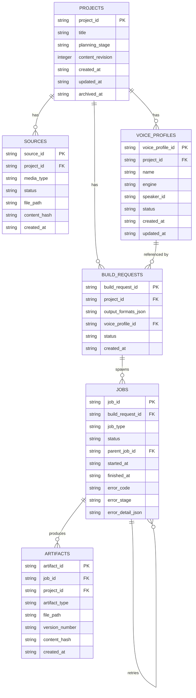

# DB全体方針

## 1. 目的

SQLite採用理由、fileとの責務分担、ERD、migration方針など、DB全体に
共通する方針を定義する。個別テーブルの詳細は`01`〜`05`で定義する。

## 2. 対象範囲

- SQLite採用理由
- fileとの責務分担
- ERD
- foreign key有効化
- migration方針
- timestamp形式
- ID規則
- pathの表現方法
- binaryを保存しない方針
- archiveと物理削除
- 最小index
- transaction境界

## 3. 対象外

- 個別テーブルの列定義(→`01`〜`05`)
- 画面からの操作(→`docs/screens/`)

## 4. 現行実装

現行コードにDB実装は存在しない。本書は新規導入方針である。

## 5. 推奨仕様

### 5.1 SQLite採用理由

- 単一利用者・単一プロセスのローカルデスクトップアプリに十分な性能を提供する。
- 追加のサーバープロセスを必要とせず、Electronアプリへ組み込みやすい。
- ファイルベースであり、バックアップがファイルコピーで完結する。

### 5.2 fileとの責務分担

`17-local-data-persistence-policy.md`のとおり、SQLiteはmetadataと実行状態の
正本、大型コンテンツ(原資料本文、画像、生成原稿、WAV、MP3等)はファイルを
正本とする。

### 5.3 ERD



TASK-BUILD-EXEC-001(2026-07-22): `voice_profiles`はVoiceProfileのDB正本として
6つ目の製品ドメインテーブルに昇格した(5.13節参照)。`build_requests.voice_profile_id`は
`voice_profiles.voice_profile_id`へのFKになった(`03-build-requests-table.md`)。
`jobs`へ`error_code`/`error_stage`/`error_detail_json`を追加し、Build実行失敗の
安定した記録先とした(`04-jobs-table.md`)。

`SCHEMA_MIGRATIONS`は内部システム管理テーブルであり、上記ERDが表す
製品ドメインの関連には含めない(5.13節参照)。列定義は
`90-schema-migrations-table.md`を正本とする。

### 5.4 foreign key有効化

SQLiteの`PRAGMA foreign_keys = ON`を接続確立時に必ず設定する。既定で
無効なSQLiteのforeign key制約を、アプリ側で明示的に有効化する。

### 5.5 migration方針

- migrationは連番付きファイルとして管理し、適用済みmigrationを内部システム管理
  テーブル`schema_migrations`(`90-schema-migrations-table.md`)へ記録する。
- アプリ起動時、未適用migrationを検出した場合、自動バックアップ後に適用する
  (`17-local-data-persistence-policy.md` 5.5節)。
- migrationは前方適用のみを基本とし、破壊的変更(列削除等)は新しいmigrationとして
  追加する(過去のmigrationファイルを書き換えない)。
- 適用済みmigrationの内容が書き換えられていないことは、`schema_migrations.checksum`
  で検証する。

### 5.6 timestamp形式

すべてのtimestamp列はISO 8601形式の文字列(例: `2026-07-19T21:00:00+09:00`)で
保存する。SQLite固有の数値epoch形式は使用しない。

### 5.7 ID規則

すべての主キーは、`01-common-identifiers-and-versioning.md`が定義する
安定ID(`project_id`等)またはそれに準じるkebab-case文字列とする。
DB固有の自動採番surrogate ID(単純な連番整数)は主キーとして使用しない。
理由: 表示名やファイル移動によってIDが変化しない、という既存原則を
DB導入後も維持するためである。

### 5.8 pathの表現方法

ファイルパスを保持する列は、可能な限りProject rootからの相対パスとする。
絶対パスを保存しない。

### 5.9 binaryを保存しない

音声・画像等のバイナリ本体は、いかなる列にも保存しない。ファイルパスと
content hashのみを保持する。

### 5.10 archiveと物理削除

物理削除(`DELETE`)は、実データを持つテーブル(projects、sources、
build_requests、jobs、artifacts)では使用しない。`projects`テーブルの
`archived_at`列による論理archiveのみを提供する。archiveされたProjectに
属するJob・Artifactの履歴も保持し続ける。

### 5.11 最小index

各テーブルの外部キー列(`project_id`、`build_request_id`、`job_id`)へ
indexを設定する。詳細は各テーブル定義(`01`〜`05`)で定義する。

### 5.12 transaction境界

1回のユースケース単位(例: Project作成、Source登録)を1つのtransactionとする。
複数テーブルへの書き込みを伴う操作は、すべて同一transaction内で完結させ、
一部のテーブルだけが更新された不完全な状態を作らない。

### 5.13 製品ドメインテーブルと内部システム管理テーブルの区別

次の6つを**製品ドメインテーブル**とする。利用者の作品データを表し、
「むやみに増やさない」という制限の対象である。

```text
projects
sources
voice_profiles
build_requests
jobs
artifacts
```

`voice_profiles`は当初5テーブルの制限内で「専用テーブルを設けず、JSON列や
最小限の親テーブル列で表現する」対象の代表例として言及されていたが、
TASK-BUILD-EXEC-001(2026-07-22, 人間承認済み設計)により、以下の理由で
6つ目の製品ドメインテーブルへ昇格した。

- VoiceProfileはProjectに対して複数存在し、名前・エンジン・話者・パラメータ・
  status(draft/approved/archived)という独立したライフサイクルを持つ。
- `build_requests.voice_profile_id`が参照整合性(FK)を持つ必要があり、
  JSON列では外部キー制約・一意性制約(`UNIQUE (project_id, name)`)を
  表現できない。
- 履歴保持(archiveのみ、物理削除禁止)を、他の製品ドメインテーブルと
  同じ規則で行う必要がある。

新しいテーブルを追加する際は、本節の昇格手順(提案→必要性の確認→承認→
昇格)に従うことを引き続き原則とする。

次を**内部システム管理テーブル**とする。利用者の作品データを表すものではなく、
5テーブル制限の対象外である。

```text
schema_migrations
```

`schema_migrations`は、次の点で製品ドメインテーブルと明確に区別する。

- ドメインテーブルとの外部キー関係を持たない。
- `projects`の archive/delete 規則(5.10節)を適用しない。
- 利用者が画面から参照・操作する対象ではない。
- 新しいテーブルを追加する際、内部システム管理テーブルの追加は
  「製品ドメインテーブルを5つに保つ」という制約に影響しない。

列定義は`90-schema-migrations-table.md`を正本とする。

## 6. 入力

- Electron mainからの接続要求

## 7. 出力

- SQLiteファイル

## 8. 必須項目

- 全テーブル共通で`created_at`
- 更新が発生するテーブルは`updated_at`

## 9. 任意項目

- `archived_at`(`projects`のみ)

## 10. バリデーション

### Error

- foreign key制約が無効化されたまま運用される。
- 絶対パスがpath列へ保存される。
- バイナリ本体が列へ保存される。

### Warning

- なし。

## 11. 状態・エラー・警告

migrationの状態は`17-local-data-persistence-policy.md` 11節のとおり。

## 12. 正常例

アプリ初回起動時、空のSQLiteファイルが作成され、migrationにより
6つの製品ドメインテーブル(projects/sources/voice_profiles/build_requests/
jobs/artifacts)と1つの内部システム管理テーブル(schema_migrations)が
作成される。

## 13. 異常例

| 状況 | 扱い |
|---|---|
| foreign key違反(存在しない`project_id`を参照する`sources`行の挿入) | エラーとして拒否する |
| migration適用中の異常終了 | 次回起動時にバックアップから安全に再試行する |

## 14. テスト観点

- foreign key制約が有効な状態で動作する。
- 空DBから全migrationが冪等に適用できる。
- 全テーブルの主キーが安定ID文字列であり、連番整数ではない。
- path列に絶対パスが保存されない。

## 15. 移行・互換性

新規スキーマであり、移行対象データはない。

## 16. 未決定事項

なし。

## 17. 完了条件

- SQLite採用理由が明記されている。
- fileとの責務分担が明記されている。
- ERDが存在し、`content_revision`がintegerで表現されている。
- foreign key有効化方針が明記されている。
- migration方針が明記されている。
- timestamp形式、ID規則、path表現、binary非保存方針が明記されている。
- archiveと物理削除の規則が明記されている。
- 最小indexとtransaction境界が明記されている。
- 製品ドメインテーブル(5つ)と内部システム管理テーブル(`schema_migrations`)が
  明確に区別されている。
