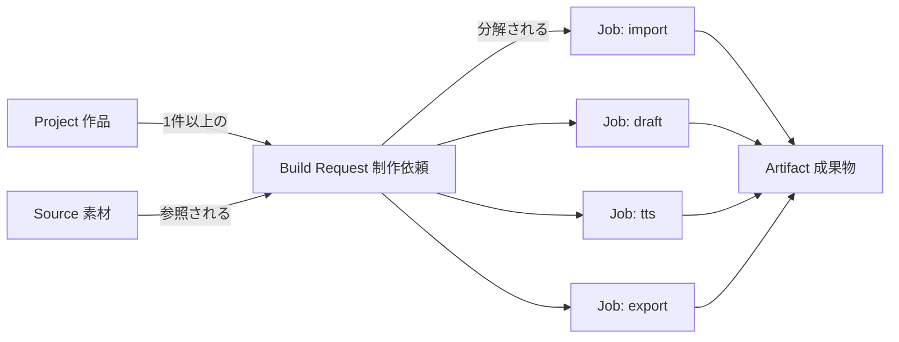
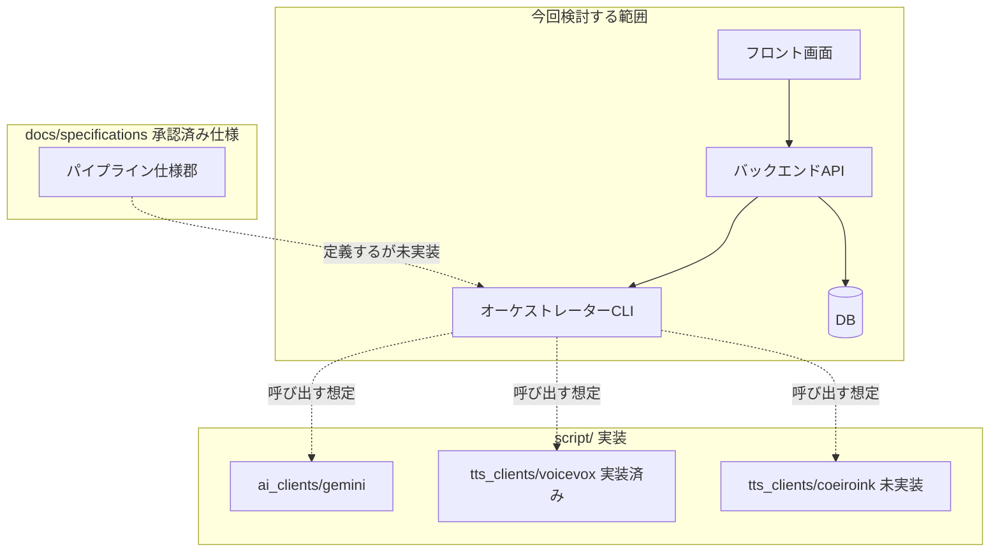

# 現状監査と製品用語の整理

## 目的

管理画面とDBの設計に先立ち、現在のCLI・設定・ファイル保存・仕様体系を棚卸しし、
「プロジェクト」「制作依頼」「ジョブ」等、製品内で使う用語の候補を確定する。
既存の開発タスク用語 (`docs/tasks/`、`TASK-*`) と製品内データ用語を混同しないことも目的とする。

## 背景

`docs/tasks/app-management-preflight-report.md` の監査により、次が判明している。

- `script/` には TTS/AI クライアント2種のみが存在し、資料入力・原稿生成・音声結合を行う
  オーケストレーターCLI (`batch_tts_sections.py` 等、承認済み仕様が「現行実装」と呼ぶもの) は
  **リポジトリ上に存在しない**。
- `data/`、`config/`、`deliverables/` の実データも存在しない。
- `17-file-based-data-persistence-policy.md` はDB導入検討の条件として「Web管理画面を実装する場合」を
  明記しており、本タスク群はまさにその条件が発生した状況である。

このため本書は、「実在するCLIから画面への移行」ではなく、
「複数の承認済み仕様が定義した将来のパイプラインを、画面とDBでどう表現するか」を扱う。

## 対象

- 承認済み仕様が定義する管理単位 (シリーズ/作品/章/セグメント/資料/承認) の用語整理。
- 製品内データにおける「タスク」的な概念 (Build Request、Job) と、開発工程のタスク (`docs/tasks/TASK-*`) の分離。
- 現状の正本一覧 (ファイルベース) と、将来のDB導入後の正本候補一覧の対比。
- 用語の日本語UIラベル候補。

## 対象外

- DBの物理スキーマ (→ `06-database-logical-schema.md`)。
- 画面の具体的なワイヤーフレーム (→ `03-frontend-information-architecture.md`)。
- 04, 05, 06, 08, 10, 11, 13, 15番の各仕様の詳細内容 (`evidence_gap`、未精読)。

## 既存仕様との関係

| 既存仕様 | 関係 |
|---|---|
| `01-common-identifiers-and-versioning.md` | `project_id`等のID体系をDB主キーの外部キー表現としてそのまま踏襲する前提とする。 |
| `02-process-input-output.md` | 工程表・正本表・ディレクトリ構成を、本書の「現在の正本一覧」の一次情報源とする。 |
| `16-ai-assisted-development-workflow.md` | `docs/tasks/` は実装タスク置き場、`docs/spec-proposals/task/` は仕様策定タスク置き場と明記されている。本タスク群のファイルは `docs/tasks/` 配下だが `SPEC-APP-*` として明確に区別され、この既存仕様と矛盾しない。 |
| `17-file-based-data-persistence-policy.md` | 本タスク群の存在自体が、同仕様が予告した「DB検討の開始」に該当する。 |
| `audiobook-creation-pipeline.md` | シリーズ/作品/章/セグメントの管理単位定義を、本書の用語集の一次情報源とする。 |

## 用語

### 1. 製品内データ用語 (今回新設・整理する候補)

| 用語 (内部ID候補) | 日本語UIラベル候補 | 定義 | 既存仕様上の対応 |
|---|---|---|---|
| `project` | プロジェクト / 作品 | 一冊のオーディオブック制作単位。長寿命。 | `project-plan.yaml` の `project_id` そのもの |
| `build_request` | 制作依頼 | 利用者が画面から「この設定で出力してほしい」と明示する1回の依頼。出力形式・声・対象範囲を含む。 | 既存仕様に直接の対応物なし (**新規概念**) |
| `job` / `job_run` | 処理ジョブ / 実行 | OCR、原稿生成、TTS、章結合、exportなど、1回の自動処理の実行単位。 | 既存仕様の「工程」を実行インスタンス化したもの |
| `source` | 素材 | PDF、EPUB、画像、Kindleキャプチャ等の原資料。 | `sources.yaml` の資料そのもの |
| `artifact` | 成果物 | MP3、テキスト、EPUB等の生成物。 | 音声manifest / deliverables の出力物 |
| `specification_task` | 仕様策定・開発タスク | `docs/tasks/`、`docs/spec-proposals/task/` 配下の開発工程管理。 | `16-ai-assisted-development-workflow.md` の `TASK-*` |

### 2. 用語衝突の注意

- 「タスク」という言葉は、製品内では `build_request` (利用者が作る制作依頼) を指す場合と、
  `docs/tasks/TASK-*` (開発実装タスク) を指す場合の2通りが混在しうる。
  **本書以降の草案では、製品内の依頼を指す場合は必ず「制作依頼 (Build Request)」と表記し、
  単に「タスク」と書かない。** 開発タスクは「開発タスク」または `TASK-*` 表記に統一する。
- 「プロジェクト」は `project-plan.yaml` の作品単位と一致させ、DBの `projects` テーブルとも同じ意味にする。
- 「ジョブ」は既存仕様の「工程 (process)」の実行時インスタンスであり、工程定義そのもの (静的) とは区別する。

## 正常系

1. 開発者/利用者が管理画面を開く。
2. 画面はDB (導入される場合) またはファイルから `project` 一覧を取得して表示する。
3. 利用者が既存の用語集 (本書) に従うラベルで操作する。
4. 内部処理は `project_id` 等の既存ID体系をそのまま使い、画面用の新しいID体系を作らない。

## 異常系

| 状況 | 扱い |
|---|---|
| 画面側が独自に新しいID体系 (例: 連番の内部surrogate ID) を作り、`project_id` と非対応になる | Error。`01-common-identifiers-and-versioning.md` 違反として拒否する。 |
| 「タスク」という言葉が製品内Build RequestとdevタスクTASK-*の両方に使われて仕様が混乱する | Warning。本書の用語表に従い是正する。 |
| 現行スクリプトが存在しない工程を画面が「既存CLIの置き換え」であるかのように説明する | Warning。存在しない実装を実在するかのように記述しない。 |

## UIまたはAPIの入出力

本タスクはUI/API自体を定義しないが、用語集は以降のAPI (`04`) とDBスキーマ (`06`) の
命名基準として使う。命名規則は次のとおり。

```text
内部識別子 (DBカラム名・APIフィールド名): snake_case、既存ID体系 (01番) 準拠
日本語UIラベル: 本書の用語集を正本とする
```

## 状態遷移

用語整理タスクそのものに状態遷移はない。参考として、本書が定義する `project` / `build_request` / `job`
の関係を下図に示す (詳細な状態機械は `07-project-task-job-workflow.md` で定義する)。



## データ所有者・正本

### 現在の正本一覧 (ファイルベース、`02-process-input-output.md` 準拠)

| 対象 | 現在の正本 |
|---|---|
| 作品企画 | `project/project-plan.yaml` |
| 資料一覧 | `project/sources.yaml` |
| 承認 | `project/approvals.yaml` |
| 章要件 | `chapters/<chapter_id>/chapter-spec.yaml` |
| 検証済み原稿 | `chapters/<chapter_id>/verified/script.yaml` |
| 音声順序 | `audio/manifests/<chapter_id>.json` |
| 正式出力一覧 | 制作manifest |

### 将来 (DB導入後) の正本候補一覧 — 本書では確定しない

| 対象 | 正本候補 | 備考 |
|---|---|---|
| Project メタデータ (状態、表示名、作成日時) | DB | 内容 (企画本文) はYAMLのまま |
| Build Request / Job 実行履歴 | DB | ファイルには存在しない新概念のため |
| Source の原本ファイル | ファイル (不変) | `05-persistence-strategy.md` で確定 |
| 承認内容の本文 | YAML (`approvals.yaml`) 継続 or DB反映 | `05` 以降で確定 |

このマトリクスは **未確定** であり、`05-persistence-strategy.md` で正式に比較・決定する。
本書はあくまで「現在の正本」と「今後検討する範囲」の見取り図を示す。

### 既存CLIから画面操作への対応表

| 想定される画面操作 | 対応する既存仕様上の工程 | 現状の実装有無 |
|---|---|---|
| 「制作依頼を作成」ボタン | 作品登録〜章仕様作成 | 未実装 (仕様のみ) |
| 「素材をインポート」画面 | 資料登録・画像取り込み・OCR | 未実装 (仕様のみ、TTS/AIクライアントのみ実装済み) |
| 「原稿を確認・承認」画面 | 検証済み原稿承認 | 未実装 |
| 「声を選ぶ」画面 | 音声プロファイル選択・試聴 | VOICEVOXクライアントは実装済み。COEIROINKは未実装 (`NotImplementedError`) |
| 「出力する」ボタン | 本番TTS〜章MP3〜deliverables | 未実装 (`batch_tts_sections.py`等のオーケストレーターが存在しない) |
| 「進捗を見る」画面 | Job監視 (新規概念) | 未実装。既存仕様に対応物なし |

### 現状構成図



## バリデーション

### Error

- 新しい内部識別子が `01-common-identifiers-and-versioning.md` の正規表現 `^[a-z0-9]+(?:-[a-z0-9]+)*$` に違反する。
- 「タスク」という語が、製品内Build Requestと開発タスクの区別なく仕様書内で使われる。

### Warning

- 用語集にない新語を後続タスク (22番以降) が導入する。
- 現状構成図に記載のない未確認コンポーネントへ言及する。

## セキュリティ・プライバシー

本タスクは用語整理のみであり、セキュリティ・プライバシーへの直接影響はない。
ただし、`build_request` や `job` という新概念がDBに保存される場合の機密性は
`13-security-backup-migration.md` で扱う参照事項として記録する。

## テスト観点

- 用語集の内部識別子がすべて `01-common-identifiers-and-versioning.md` のID正規表現を満たす。
- 「タスク」の二義性が後続の草案 (21〜39すべて) で一貫して区別されている。
- 現状構成図が「未実装」コンポーネントを実在するかのように描いていない。
- 既存CLI対応表が、実際に存在しないコマンドを実在すると誤記していない。

## 移行・互換性

- 既存ID体系 (`project_id`、`chapter_id`、`segment_id`等) は変更しない。
- `book_id` 等の旧形式は `01-common-identifiers-and-versioning.md` の変換表にそのまま従う。
- 新規概念 (`build_request`、`job`) は既存ファイルスキーマへの後方互換を壊さない、独立した追加概念として導入する。

## 未決定事項

- `evidence_gap`: 04, 05, 06, 08, 10, 11, 13, 15番の仕様内容 (未精読)。これらに矛盾する用語がないか、人間レビューで確認する。
- `build_request` を将来的に `project-plan.yaml` 内の概念として吸収するか、完全に独立させるかは `07-project-task-job-workflow.md` で決定する。
- 日本語UIラベルの最終確定 (「制作依頼」「処理ジョブ」等) は `03-frontend-information-architecture.md` 以降のUIレビューで見直す余地を残す。

## 人間レビュー項目

- `human_review_required`: 「制作依頼 (Build Request)」という新規概念を、既存の承認済み仕様体系に追加してよいか。
- `human_review_required`: 04/05/06/08/10/11/13/15番の未精読仕様と本書用語集に矛盾がないかの最終確認。
- 草案全体の採否と未決定事項 (タスク指示の共通要求)。

## 仕様昇格条件

- 用語集がすべての後続草案 (01〜17) で一貫して使用されていること。
- `evidence_gap` として記録した未精読仕様が人間により解消されていること。
- 「タスク」の二義性についての注記が、実装タスク化の際に開発者へ周知されていること。
- 人間が用語集 (日本語ラベル含む) を承認していること。
