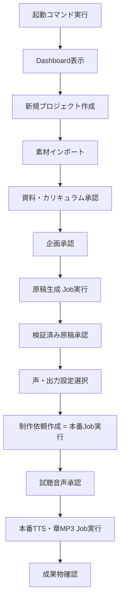

# 製品範囲・利用者導線・MVP

## 目的

ローカル管理アプリとしての目的、利用者、MVP範囲、対象外を定め、
利用者が一冊のオーディオブックを企画から成果物確認まで完成させる導線を草案化する。

## 背景

`00-current-state-and-terminology.md` の用語整理により、
`project`（プロジェクト）、`build_request`（制作依頼）、`job`（処理ジョブ）、
`source`（素材）、`artifact`（成果物）を製品内の基本単位とすることを前提とする。
利用者から明示された最低限の要求は次のとおりである。

- コマンド一つで管理画面が開く。
- 制作タスク(=制作依頼)を新規作成できる。
- 素材をインポートできる。
- 出力形式(MP3・テキスト・EPUB)を選べる。
- 声・音声プロファイルを選べる。

本書はこの最低要求を超えて、承認済み仕様が要求する4段階承認・資料戦略・
AIモデルルーティング等を画面からどこまで扱うかを、MVPと後続に仕分ける。

## 対象

- 単一PC・単一利用者のローカル利用を前提とした製品範囲。
- 一冊を完成させる最短導線 (ハッピーパス)。
- MVP / 次期 / 対象外の切り分け。
- 高リスク操作 (承認・削除・強制実行等) の扱い方針。

## 対象外

- 具体的な画面レイアウト (→ `03-frontend-information-architecture.md`)。
- 技術スタックの選定 (→ `02-architecture-and-runtime.md`)。
- DB物理設計 (→ `06-database-logical-schema.md`)。

## 既存仕様との関係

| 既存仕様 | 関係 |
|---|---|
| `audiobook-creation-pipeline.md` | 4段階承認 (資料・カリキュラム/企画/検証済み原稿/試聴音声) を画面からも迂回不可とする前提を踏襲する。 |
| `03-project-plan-schema.md` | `planning_stage` (`registered`→`curriculum_draft`→`review_pending`→`approved`) を画面のProjectウィザードの土台とする。 |
| `07-approval-workflow.md` | 承認状態 (`draft`〜`invalidated`) をそのままJob/Build Requestの前提ゲートとして扱う。 |
| `17-file-based-data-persistence-policy.md` | 「Web管理画面を実装する場合」がDB検討条件であり、本書がその製品範囲を定義する文書にあたる。 |

## 用語

`00-current-state-and-terminology.md` の用語集をそのまま使用する。追加用語なし。

## 1. ペルソナ

| ペルソナ | 説明 |
|---|---|
| 主ペルソナ: 個人学習者 兼 制作者 | 本リポジトリの利用者本人。単一PCでオーディオブックを企画・確認・出力する。技術知識はあるが、毎回CLIオプションを覚えるコストを避けたい。 |
| 副ペルソナ(将来候補): 監修者 | 原稿・音声のレビューのみ行う。MVPでは同一PC上の同一利用者として扱い、権限分離はしない (→ `09-review-and-approval-workflow.md` の未決定事項)。 |

## 2. 主要ユースケース

1. 新しいオーディオブック・プロジェクトを作る。
2. 素材 (PDF/EPUB/画像/Kindleキャプチャ/既存テキスト) を登録する。
3. 資料・カリキュラム、企画、原稿、試聴音声を確認・承認する。
4. 出力形式と声を選び、制作依頼を作成する。
5. 処理ジョブの進捗を監視し、失敗時に対処する。
6. 成果物を確認し、フォルダを開く/再生成する。
7. 既存プロジェクトを一覧・再開・複製・archiveする。

## 3. MVP / 次期 / 対象外

| 範囲 | 機能 | 理由 |
|---|---|---|
| **MVP** | プロジェクト新規作成ウィザード | 利用者の最低要求(1) |
| **MVP** | 素材インポート (ファイル選択・種類判定・順序確認) | 利用者の最低要求(2) |
| **MVP** | 出力形式選択 (MP3・テキスト、EPUBはdisabled候補) | 利用者の最低要求(3)。EPUBは下位仕様未確認のためdisabled候補 (`10`参照) |
| **MVP** | 声・音声プロファイル選択と試聴 | 利用者の最低要求(4) |
| **MVP** | 4段階承認の一覧・個別確認・承認操作 | `07-approval-workflow.md` を画面から迂回させないため必須 |
| **MVP** | Job進捗表示・失敗時のエラー表示・再試行 | 実行が長時間になるため画面上の監視が最低限必要 |
| **MVP** | 成果物一覧・フォルダを開く | 出力確認は最低要求(3)の帰結として必須 |
| **MVP** | 単一コマンドでの起動 | タスク前提条件 |
| 次期 | プロジェクトの複製・archive | 運用上便利だが完成導線に必須ではない |
| 次期 | 差分再生成 (変更segmentのみ) の画面表示 | 既存仕様の部分再生成機構をUIへ反映する応用機能 |
| 次期 | 原稿の詳細編集 (diff・差し戻し理由入力) | `09` で範囲を検討、MVPは確認・承認のみに限定 |
| 次期 | 出力履歴・バージョン比較 | 運用性向上機能 |
| 次期 | AI利用コスト・使用量の画面表示 | `18-ai-model-routing-and-cost-control.md` の記録機構をUI化 |
| 将来 | 複数利用者・権限分離 | 単一利用者前提から逸脱するため大きな設計変更を要する |
| 将来 | クラウド同期・リモートアクセス | ローカル前提を超える将来候補 |
| 将来 | 高度な原稿編集エディタ (WYSIWYG的な音声台本編集) | 実装量が大きく、MVPの完成を遅らせるリスクがある |
| 対象外 | 動画・授業録音の自動取り込み | 承認済み仕様が対象外と明記 (`audiobook-creation-pipeline.md` §3) |
| 対象外 | 資料の法的利用可否の自動判定 | 承認済み仕様が明確に対象外 |

## 4. 新規作成時に必要な最小情報

`03-project-plan-schema.md` の必須項目のうち、`registered` 段階で必要な最小集合をMVPのフォーム項目候補とする。

```yaml
project_id: (自動生成候補 or 手動入力)
title: 必須
domain: 必須 (自由入力 + 既存例のサジェスト)
purpose: 必須
usage_purpose: 必須 (既定値 personal_learning)
target_audience.description: 必須
source_strategy: 1件以上必須
```

章 (`chapters`) は `registered` では0件を許可するため、MVPウィザードでは
「後で章を追加する」を許容する。

## 5. 正常導線 (ハッピーパス)



## 6. 失敗・中断導線

| 中断ポイント | 扱い |
|---|---|
| 素材インポート中にアプリを閉じる | 未完了importは`review_required`のまま保持し、再開時に一覧へ表示する (`08`参照)。 |
| 原稿生成Job実行中に電源断 | Jobは`failed`または`stale`として再起動時に検出され、再試行を促す (`12`参照)。 |
| 承認待ちのまま長期間放置 | 特別な自動処理は行わない。一覧に「承認待ち」件数を表示するのみ (次期: 通知)。 |
| 出力設定が未確定のまま制作依頼を作ろうとする | フォームバリデーションで停止し、Job起動不可とする。 |

## 7. 画面から実行しない高リスク操作

- `--force` による承認バイパス実行 (`07-approval-workflow.md` の開発用強制実行) は、
  MVP画面からは提供しない。CLI限定の開発者向け操作として維持する。
- プロジェクトやDBの完全削除は、MVPでは「archive」のみ提供し、物理削除はCLI/手動操作に限定する
  (`13-security-backup-migration.md` で詳細化)。
- 資料の権利・利用可否の最終法的判断はシステムが代行しない (既存仕様どおり)。

## データ所有者・正本

本書は範囲定義のみであり、正本の変更は行わない。`00-current-state-and-terminology.md`
の正本一覧をそのまま参照する。

## バリデーション

### Error

- MVP範囲外の機能 (例: 複数利用者権限) を後続タスクがMVPとして実装しようとする。
- `registered`段階の必須項目 (title, domain, purpose, usage_purpose, target_audience, source_strategy) を欠いたままプロジェクト作成を完了させる導線。

### Warning

- EPUB出力をMVPへ含めようとする (下位仕様が未確認のため)。
- 高リスク操作 (`--force`相当) を通常画面から実行可能にしようとする設計。

## セキュリティ・プライバシー

高リスク操作をMVP画面から排除する方針そのものが、誤操作によるデータ破損・未承認出力混入の
リスク低減策である。詳細な脅威モデルは `13-security-backup-migration.md` に委譲する。

## テスト観点

- MVP導線 (新規作成→素材→承認→出力→成果物確認) をE2Eシナリオとして再現できる。
- `registered`段階で章0件のプロジェクトを作成できる。
- `review_pending`/`approved`へ進める前に章1件以上を要求する (`03-project-plan-schema.md` 準拠)。
- 高リスク操作がMVP画面のどのボタンからも呼び出せないことを確認できる。
- 中断シナリオ (素材import中断、Job実行中の中断) からの再開が導線として成立する。

## 移行・互換性

既存の承認済みパイプライン仕様の工程順序 (`audiobook-creation-pipeline.md` §9) を変更しない。
画面はこの工程順序を可視化・操作するレイヤーとして追加されるものであり、
工程そのものを置き換えない。

## 未決定事項

- EPUB出力をMVPに含めるか次期にするかは、EPUB関連の下位仕様 (`docs/spec-proposals/generated-specifications/epub-text-extraction.md` 等、未承認) の確定状況に依存する。現時点では次期候補とし、`10-output-and-export-settings.md` で再確認する。
- 監修者ロール分離の要否 (将来候補) は人間判断が必要。
- 原稿編集のMVP範囲 (確認・承認のみか、簡易編集を含めるか) は `09-review-and-approval-workflow.md` で最終決定する。

## 人間レビュー項目

- `human_review_required`: MVP機能一覧の最終確定 (特にEPUBと差分再生成の扱い)。
- `human_review_required`: 単一利用者前提を維持する期間の判断。
- 草案の採否と未決定事項。

## 仕様昇格条件

- MVP/次期/将来/対象外の分類に、人間の承認が得られていること。
- ハッピーパスのE2Eシナリオが `14-testing-and-acceptance.md` のテスト観点と整合していること。
- 高リスク操作の画面除外方針が `13-security-backup-migration.md` と矛盾しないこと。
