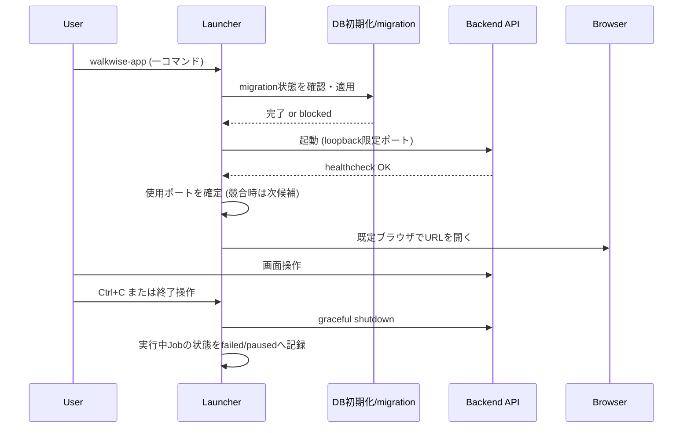

# アプリケーション構成・技術スタック・起動方式

## 目的

フロント、Python処理、DB、ローカルTTSエンジン、ファイルシステムを接続する構成案を
最低3案比較し、Windows上で「一つのコマンドから画面が開く」起動方式を草案化する。

## 背景

`00`の監査より、現状 `script/` にはHTTPサーバーもフロントエンドも存在せず、
`requirements.txt` にもWebフレームワーク・DBドライバは含まれない。
本書はゼロからの構成選定であり、既存実装からの移行ではなく新設として扱う。

`16-ai-assisted-development-workflow.md` は正式実行環境をDockerとしつつ、
「VOICEVOX、COEIROINK、GUI操作など、ホスト上のサービスや画面操作が必要なものは例外」
と明記している。管理画面はまさにこの例外に該当するため、
Docker一本化ではなくホストWindows実行を主経路として検討する必要がある。

## 対象

- Backend/Frontend/Packaging方式の比較 (最低3案)。
- 一コマンド起動の設計。
- Windows/Dockerの扱い分け。
- ジョブ処理方式 (同一プロセス/サブプロセス/ワーカー)。
- 開発用・利用者用コマンドの区別。

## 対象外

- 画面の情報設計 (→ `03`)。
- APIエンドポイント設計 (→ `04`)。
- DB選定の詳細な永続化責務 (→ `05`)。

## 既存仕様との関係

| 既存仕様 | 関係 |
|---|---|
| `16-ai-assisted-development-workflow.md` §13.4 | Docker=正式、ローカル=補助という原則があるが、GUI・ローカルサービスは例外と明記。本書はこの例外規定を適用する。 |
| `17-file-based-data-persistence-policy.md` | DB導入自体は本書の対象外 (`05`,`06`で扱う) だが、DBを使う場合の起動シーケンスに関わるため参照する。 |
| VOICEVOX/COEIROINKクライアント (`script/tts_clients/`) | HTTPベースのローカルサービスとして「アダプタ越しに扱う」という初期仮説を維持する根拠になる。 |

## 用語

- **application service**: フロント/CLIから共通に呼び出される、Python側の業務ロジック層。
- **launcher**: 一コマンド起動を実現する起動スクリプト/実行体。
- **loopback限定**: `127.0.0.1` のみで待受し、外部ネットワークからアクセスできない状態。

## 技術スタック比較 (最低3案)

### 案A: FastAPI (Python) + Vue 3 / Vite SPA

| 項目 | 内容 |
|---|---|
| 概要 | PythonバックエンドをFastAPI等のASGIフレームワークで実装し、別途ビルドしたVue SPAを配信する。 |
| 利点 | 既存Python資産 (ai_clients, tts_clients) をそのままapplication serviceとして呼び出せる。SSE/WebSocketによるJob進捗配信と相性が良い。フロントの対話性 (wizard、状態保持)を作りやすい。 |
| 欠点 | フロントとバックエンドを別ビルドパイプラインで管理する必要がある。Node.js等のフロントビルド環境がホストに必要。 |
| Windows一コマンド起動 | launcherがuvicorn等でAPIを起動し、静的ビルド済みSPAを同一プロセスから配信し、既定ブラウザを開く。 |
| 判断条件 | 既存Pythonロジックとの統合しやすさ、長時間Job監視のUX (進捗バー、キャンセル)を重視する場合に有利。 |

### 案B: Python (Flask/FastAPI) + サーバーサイドレンダリング (Jinja2 + HTMX)

| 項目 | 内容 |
|---|---|
| 概要 | Pythonのみでテンプレートレンダリングし、HTMX等で部分更新する。 |
| 利点 | フロント専用のビルド環境・Node.js依存が不要。単一言語・単一プロセスで完結しやすく、配布が単純。 |
| 欠点 | 複雑な状態管理 (wizardの多段階入力、リッチな進捗表示)がSPAより書きにくい。将来的にリッチな編集UI (原稿diff等)が必要になった場合の拡張性が案Aより劣る。 |
| Windows一コマンド起動 | launcherがFlask/FastAPI開発・本番サーバーを起動しブラウザを開くのみで、フロントビルド手順が不要な分シンプル。 |
| 判断条件 | フロントのリッチさより配布の単純さ・依存の少なさを優先する場合に有利。 |

### 案C: Tauri (Rust shell) + Web frontend、Pythonはサイドカー

| 項目 | 内容 |
|---|---|
| 概要 | デスクトップアプリとして配布し、Python処理をサイドカープロセスまたは組み込みインタプリタで実行する。 |
| 利点 | 「アプリを起動するだけ」のUXを最も自然に実現できる (ブラウザ手動起動が不要)。ウィンドウ管理・ファイルダイアログ等のOS統合が容易。 |
| 欠点 | Rustツールチェーンの追加が必要で、既存Python中心の開発体制との親和性が低い。ビルド・配布の複雑度が最も高く、既存の軽量なリポジトリ構成から乖離が大きい。 |
| Windows一コマンド起動 | 実行ファイルをダブルクリックまたは1コマンドで起動でき、ブラウザ非依存。 |
| 判断条件 | 将来的に非技術者への配布や、ブラウザ常駐を避けたい要求が明確になった場合に再検討する。 |

### 比較まとめ

| 観点 | 案A SPA | 案B SSR/HTMX | 案C Tauri |
|---|---|---|---|
| 既存Python資産との親和性 | 高 | 高 | 中 (サイドカー化必要) |
| 追加ツールチェーン | Node.js | なし | Rust + Node.js |
| リッチな進捗/wizard UI | 高 | 中 | 高 (Web部分は同等) |
| 一コマンド起動の自然さ | 中 (ブラウザを開く) | 中 (ブラウザを開く) | 高 (ネイティブウィンドウ) |
| 開発初速 (MVP) | 高 | 最高 | 低 |
| 将来の拡張性 (編集UI等) | 高 | 中 | 高 |

### 採用判断

**MVPでは案Aを暫定推奨とする。** 理由: 長時間Job監視・段階的wizard・将来の原稿編集UIなど
リッチな対話性の要求が `01-product-scope-and-mvp.md` に多く含まれる一方、
案Cの追加ツールチェーンコストはMVP段階では過大と判断する。
案Bはフロントビルド不要という利点が大きいため、`human_review_required` として
人間が最終確認する際の対抗案として残す。案Cはデスクトップ配布の要求が明確化した時点の
将来候補として保持する (`01`の「将来」区分と対応)。

この判断は暫定 (`provisional`) であり、`evidence_gap`: 実際のNode.jsツールチェーン導入可否や
開発者の選好は人間確認が必要。

## Application Service化の方針

既存 `script/ai_clients/`、`script/tts_clients/` は関数ベースのモジュールである。
これらをAPIから呼び出す際、CLIとAPIが同じロジックを共有できるよう、
将来的に薄いapplication service層 (`script/app_services/` 等、実装タスクで確定) を新設し、
CLIとAPIの双方がそこを呼び出すアダプタ構成にすることを推奨する。
本書では方針のみ示し、具体的なモジュール分割は `04-backend-api-and-service-boundary.md` に委譲する。

## 一コマンド起動設計

### 起動・終了シーケンス



### port競合時の動作

1. 既定ポート (例: 8765) の使用を試みる。
2. 使用中の場合、`+1`した候補ポートを最大N回試行する (Nはlauncher設定)。
3. 全候補が使用中の場合、エラーメッセージと使用中プロセスの確認手順を表示して終了する (自動でプロセスをkillしない)。

### Windows/Docker構成

| 実行環境 | 用途 | 起動方法 |
|---|---|---|
| Windowsホスト直接実行 (推奨) | 通常利用。VOICEVOX/COEIROINK等のローカルGUIサービスやファイルダイアログに直接アクセスできる。 | `walkwise-app.bat` 等のlauncherスクリプトを1回実行。 |
| Docker (開発・CI用途) | テスト実行、CI、非GUI処理の再現性確保。 | `docker compose run --rm app pytest ...` 等、既存の開発コマンド体系を維持。 |

DockerコンテナからホストのVOICEVOX/COEIROINK (ローカルサービス) へ到達させるには
ホストネットワークやポートマッピングの追加設定が必要になり、GUI操作 (Kindleキャプチャ等) は
コンテナ内から実行できない。したがって**利用者向けの管理画面本体はWindowsホスト直接実行を正式経路とし、
Dockerは開発・テスト用途に限定する**方針を採る。これは`16-ai-assisted-development-workflow.md` §13.4の
例外規定の適用である。

### 開発用・利用者用コマンド案

```yaml
canonical_user_command:
  description: "利用者が使う正式な起動コマンド"
  windows_batch: "walkwise-app.bat"
  behavior:
    - DB migration確認
    - APIサーバー起動 (loopback限定)
    - 既定ブラウザでdashboardを開く

convenience_dev_commands:
  - description: "APIのみ起動 (フロント開発時)"
    command: "uvicorn app.main:app --reload"
  - description: "フロントのみ起動 (Vite dev server)"
    command: "npm run dev"
  - description: "テスト実行 (既存方針どおりDockerを正式とする)"
    command: "docker compose run --rm app pytest -m \"not external and not manual\""
```

## ジョブ処理方式比較

| 方式 | 概要 | 利点 | 欠点 |
|---|---|---|---|
| 同一プロセス内スレッド/asyncタスク | APIプロセス内でバックグラウンドタスクとして実行 | 実装が単純、追加プロセス管理不要 | APIプロセス再起動でJobが失われる、CPUバウンド処理でイベントループを塞ぐ懸念 |
| サブプロセス起動 (既存CLI相当を子プロセスとして実行) | Job実行を独立プロセスに分離 | APIクラッシュとJob実行が分離される、既存CLIとの親和性が高い | プロセス間の進捗連携・キャンセル制御を自作する必要 |
| 専用ワーカー (別プロセスのworkerがqueueを消費) | DBまたはファイルベースのqueueをworkerが処理 | 再起動やキャンセルの取り扱いが体系化しやすい、将来の並列実行に拡張しやすい | 導入コストが最も高く、MVP規模には過大な可能性 |

**採用判断**: MVPでは「サブプロセス起動」方式を暫定推奨とする。理由:
既存の(将来実装される)CLIオーケストレーターをそのまま子プロセスとして呼び出せるため、
CLIとAPIのロジック共有が最も単純になる。専用ワーカーは、Job数が増え並列実行要求が
明確化した時点の次期候補とする (`12-job-monitoring-and-recovery.md` で詳細化)。

## 開発・配布・更新方法

- 開発時: リポジトリをclone後、Python仮想環境 (venv) とフロントのnode_modulesをセットアップし、
  上記convenience commandsで個別起動する。
- 配布時 (MVP): リポジトリのままpip install + 起動スクリプト実行を正式手順とする。
  実行ファイル化 (PyInstaller等) は次期検討。
- 更新時: DB migrationは起動時に自動検出・適用する設計とし、`13-security-backup-migration.md` の
  migration方針に従う。

## データ所有者・正本

本書はアーキテクチャ選定のみを扱い、データ正本の決定は `05-persistence-strategy.md` に委譲する。

## バリデーション

### Error

- APIが loopback以外 (`0.0.0.0` 等) で既定バインドされる設計。
- Job実行方式がキャンセル不可能な設計になっている。

### Warning

- port競合時に自動で他プロセスをkillする設計。
- Dockerコンテナ内からGUI操作 (Kindleキャプチャ等) を実行しようとする設計。

## セキュリティ・プライバシー

- 既定は `127.0.0.1` (loopback) 限定バインドとし、外部ネットワークからの接続を許可しない。
  詳細な脅威モデルは `13-security-backup-migration.md` に委譲する。

## テスト観点

- 一コマンド起動でAPIが起動し、既定ブラウザが開くことを手動スモークテストで確認する。
- port競合時に候補ポートへフォールバックすることを確認する。
- Ctrl+C等の終了操作で実行中Jobが安全に `failed`/`paused` 等へ記録されることを確認する。
- Docker経由の既存テストコマンド (`docker compose run --rm app pytest ...`) が引き続き成功する。

## 移行・互換性

- 既存の `docker-compose.yml`、`Dockerfile` は変更しない (本タスクの安全規則)。将来の実装タスクで、
  開発・テスト用途のDocker構成として維持しつつ、利用者向け起動はホスト直接実行を追加する形にする。

## 未決定事項

- `evidence_gap`: Node.jsツールチェーンの導入可否 (開発者のローカル環境事情は本タスクからは確認不能)。
- 案A/B/Cのうちどれを最終採用するかは人間の確認を要する (`human_review_required`)。
- 実行ファイル化 (PyInstaller等) の要否は次期検討。
- 専用ワーカー方式への移行タイミングは、実際の同時Job数の要求が明確になってから判断する。

## 人間レビュー項目

- `human_review_required`: 案A (FastAPI+Vue SPA) を採用してよいか、または案Bのシンプルさを優先するか。
- `human_review_required`: Windowsホスト直接実行を正式経路とする方針が、既存Docker中心の開発方針と整合するかの最終確認。
- 草案の採否と未決定事項。

## 仕様昇格条件

- 3案の比較表に人間の承認が得られていること。
- 一コマンド起動のシーケンス図が `04-backend-api-and-service-boundary.md` のAPI起動処理と整合していること。
- Windows/Docker使い分け方針が `16-ai-assisted-development-workflow.md` の例外規定と矛盾しないこと。
