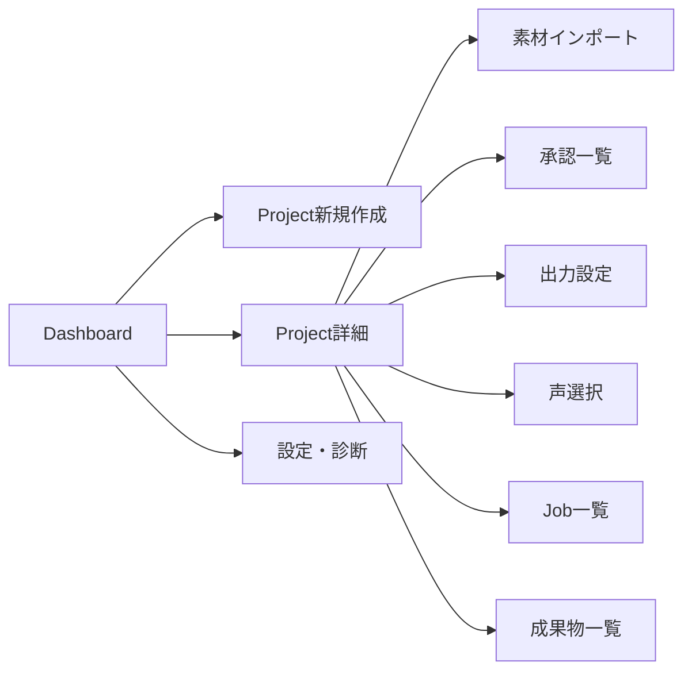

# フロント画面・情報設計・操作導線

## 目的

管理画面のページ構成、navigation、フォーム、一覧、詳細、確認画面を草案化する。

## 背景

`01`のMVP範囲 (新規作成、素材import、承認、出力・声選択、Job監視、成果物確認) と、
`02`で暫定採用したSPA構成 (案A) を前提に、画面一覧とnavigationを設計する。

## 対象

- 画面一覧とnavigation map。
- 主要wireframe (文章・Mermaid)。
- フォーム項目。
- empty/loading/error/disabled状態。
- 破壊操作の確認方法。

## 対象外

- APIの具体的なリクエスト/レスポンス (→ `04`)。
- 出力設定・声選択の詳細項目 (→ `10`, `11`。本書では画面配置のみ扱う)。

## 既存仕様との関係

`01`のMVP/次期分類にある画面のみをMVPスコープとし、それ以外は「後続画面」として明示する。

## 用語

- **wizard**: 複数ステップに分けた入力フォーム。各ステップで保存可能。

## 画面一覧

| # | 画面 | 区分 | 概要 |
|---|---|---|---|
| 1 | Dashboard | MVP | Project一覧、承認待ち件数、実行中Job件数のサマリ |
| 2 | Project新規作成 (wizard) | MVP | `01`の最小情報を段階入力 |
| 3 | Project詳細 | MVP | 章一覧、承認状態、Build Request履歴のタブ |
| 4 | 素材インポート | MVP | ファイル選択、種類判定、順序確認 (`08`) |
| 5 | 承認一覧・個別確認 | MVP | 4段階承認の状態と差し戻し (`09`) |
| 6 | 出力設定 | MVP | 出力形式・profile選択 (`10`) |
| 7 | 声・音声プロファイル選択 | MVP | engine/speaker選択・試聴 (`11`) |
| 8 | Job一覧・詳細 | MVP | 進捗、ログ、cancel/retry (`12`) |
| 9 | 成果物一覧 | MVP | artifact一覧、フォルダを開く、再生成 |
| 10 | 設定・診断 | MVP | TTS engine疎通確認、AI API key状態、容量診断 |
| 11 | 原稿編集 (詳細) | 次期 | diff・差し戻し理由入力の高度化 |
| 12 | Project複製・archive | 次期 | `15`の追加提案候補 |
| 13 | コスト・使用量ダッシュボード | 次期 | `18-ai-model-routing-and-cost-control.md` の可視化 |

## navigation map



## 主要wireframe (文章表現)

### Dashboard

```text
[Header: アプリ名 / 設定へのリンク]
[Project一覧テーブル: 名前 | 状態 | 承認待ち件数 | 最終更新 | 開く]
[右上: + 新規プロジェクト]
[サマリカード: 実行中Job数 / 承認待ち総数 / 直近失敗Job]
```

### Project新規作成 (wizard)

```text
Step1: 基本情報 (title, domain, purpose, usage_purpose, target_audience)
Step2: 資料戦略 (source_strategy 1件以上選択)
Step3: 章 (0件可、後で追加できる旨を明示)
Step4: 確認画面 → 「registeredとして保存」
```

各ステップは「保存して後で続ける」を許可し、途中離脱時も`registered`として保存する。

### 素材インポート

```text
[ドラッグ&ドロップ領域 / ファイル選択ボタン]
[取り込み候補一覧: ファイル名 | 推定種類 | 順序(ドラッグ並べ替え) | 権利状態]
[各行に: 種類修正ドロップダウン、削除]
[下部: 「取り込みを開始」ボタン → import Jobを起動]
```

### 承認一覧

```text
[4段階の状態バッジ: 資料・カリキュラム / 企画 / 検証済み原稿 / 試聴音声]
[各行クリックで詳細へ: 対象、hash、差し戻し理由入力欄、承認/差し戻しボタン]
```

### Job一覧・詳細

```text
[Job一覧: ID | 種類 | 状態 | 進捗% | 開始時刻 | 操作(cancel/retry)]
[詳細: step別ログ、エラー要約、技術ログ(折りたたみ)]
```

## フォーム項目 (代表例: Project新規作成)

| 項目 | 型 | 必須 | 備考 |
|---|---|---|---|
| title | 文字列 | 必須 | |
| domain | 文字列(サジェスト付き自由入力) | 必須 | `03-project-plan-schema.md` §9の例をサジェスト |
| purpose | 複数行文字列 | 必須 | |
| usage_purpose | 選択式 | 必須 | 既定値 `personal_learning` |
| target_audience.description | 文字列 | 必須 | |
| source_strategy | 複数選択 | 1件以上必須 | `open_fulltext`/`hybrid_reconstruction`/`licensed_reference` |

## empty/loading/error/disabled状態

| 状態 | 適用画面例 | 表示方針 |
|---|---|---|
| empty | Project一覧が0件 | 「最初のプロジェクトを作成」への導線を強調表示 |
| loading | Job一覧取得中 | skeleton表示、タイムアウト時は再試行ボタン |
| error | API呼び出し失敗 | 利用者向け要約メッセージ + 技術詳細の折りたたみ (`04`のerror schemaと対応) |
| disabled | EPUB出力選択肢 | 「下位仕様未確定のため準備中」のツールチップを表示し、押下不可にする |

## 破壊操作の確認方法

| 操作 | 確認方法 |
|---|---|
| Project archive | モーダルで対象名を再表示し「archiveする」ボタンを明示 (物理削除ではない旨も明記) |
| 差し戻し (承認却下) | 理由入力を必須にしてから確定 |
| 成果物の再生成 (既存artifactの上書きに繋がる操作) | 「既存成果物はversion管理され上書きされません」等、影響範囲を明示してから実行 |

`--force`相当の承認バイパスは、`01`の方針どおり画面に一切表示しない。

## スマホ対応の要否

MVPはローカルPC単一利用者を前提とするため、モバイル対応は次期以降とする (`01`参照)。
最低限、極端な小画面での崩れがないレスポンシブ基礎対応は行うが、専用モバイルUIは設計しない。

## MVP画面と後続画面

上記画面一覧の「区分」列のとおり。MVPは1〜10、次期は11〜13。

## アクセシビリティとキーボード操作

- フォームはタブ移動可能な順序を維持する。
- 破壊操作の確認モーダルはEscでキャンセル可能にする。
- 詳細なアクセシビリティ基準 (WCAG準拠レベル等) は本書では未確定とし、次期の受け入れ条件で検討する。

## データ所有者・正本

画面は正本を持たない。表示専用のview modelはAPI (`04`) から取得する。

## バリデーション

### Error

- 必須フォーム項目が未入力のまま次ステップへ進める設計。
- 破壊操作 (archive、差し戻し) に確認ステップがない設計。

### Warning

- disabled理由が画面上に説明されない (単に押せないだけの状態)。

## セキュリティ・プライバシー

- ファイル選択・ドラッグ&ドロップで受け取るパスは、`04`のpath安全性方針に従いバリデーションする前提を明示するのみとし、実装詳細は`04`に委譲する。

## テスト観点

- 各画面のempty/loading/error/disabled状態がモックデータで再現できる。
- wizardの「保存して後で続ける」が`registered`状態として保存され、再訪時に復元される。
- 破壊操作が確認ステップなしに実行できないことをE2Eで検証する。

## 移行・互換性

新規画面設計であり、移行対象となる既存UIは存在しない。

## 未決定事項

- アクセシビリティ基準の具体レベル。
- モバイル対応の詳細範囲。
- 原稿編集画面 (次期) のUI方式 (シンプルフォーム vs リッチエディタ)。

## 人間レビュー項目

- `human_review_required`: 画面一覧・MVP範囲の最終承認。
- `human_review_required`: wizardのステップ分割が実際の利用感覚に合うかはプロトタイプでの確認を推奨。
- 草案の採否と未決定事項。

## 仕様昇格条件

- 画面一覧とnavigation mapが`01`のMVP範囲と一致していること。
- 破壊操作の確認方法が`13-security-backup-migration.md`の方針と整合していること。
- 人間によるwireframeレビューが完了していること。
