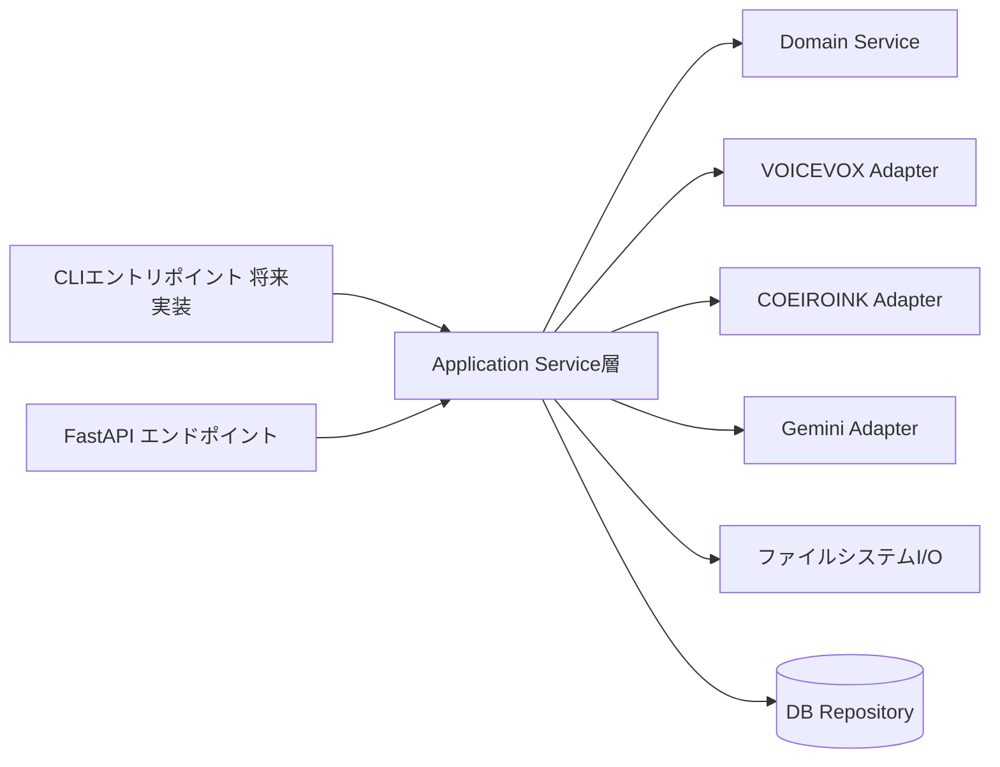
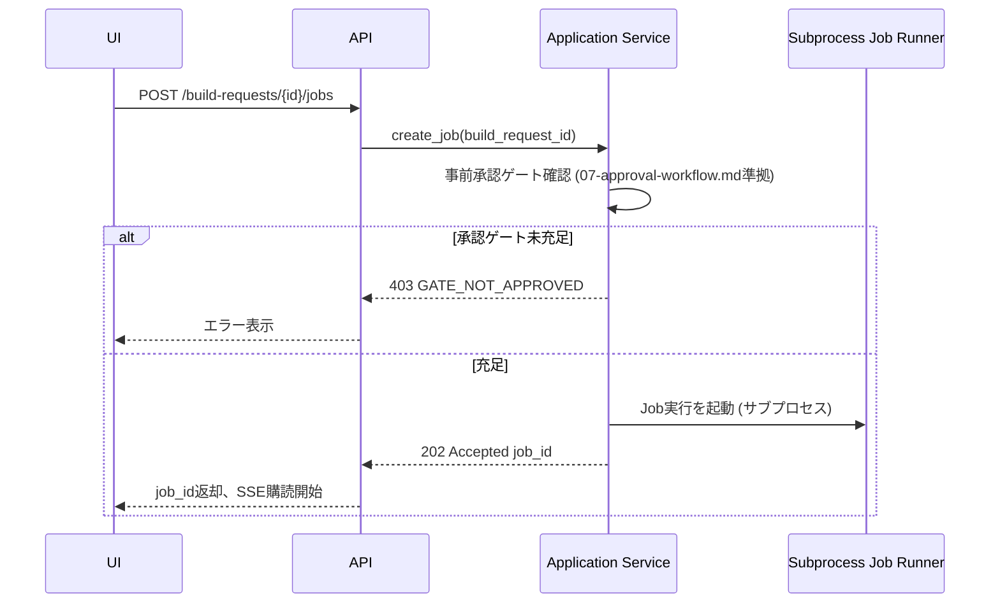

# バックエンドAPIとapplication service境界

## 目的

フロントから既存Python処理を安全に呼び出すAPI、application service、domain service、
adapter境界を定義する。

## 背景

`02`で暫定採用したFastAPI(案A)を前提に、CRUD操作とJob実行を分離するAPI設計を行う。
現状 `script/` にはCLIオーケストレーターが存在しないため、本書はゼロベースの層設計となる。

## 対象

- API一覧 (CRUD、Job制御)。
- application service / domain service / adapter層の責務分離。
- CLIとAPIの共通化方針。
- error schema。
- path安全性。

## 対象外

- DB物理スキーマ (→ `06`)。
- Job状態機械の詳細 (→ `07`)。

## 既存仕様との関係

`script/ai_clients/gemini/client.py`、`script/tts_clients/voicevox/client.py` を
adapter層の実例として位置付け、これらをapplication serviceが呼び出す構成にする。

## 用語

- **application service**: Project/BuildRequest/Job等のユースケースを実装する層。
- **domain service**: 承認無効化判定、ID検証等の純粋ロジック。
- **adapter**: VOICEVOX/COEIROINK/Gemini等、外部プロセス・外部APIとの境界。

## REST/RPC/WebSocket・SSEの使い分け

| 種別 | 用途 | 採用 |
|---|---|---|
| REST (CRUD) | Project/Source/BuildRequest/OutputProfile/VoiceProfileRef等の作成・参照・更新 | 採用 |
| Job起動 | POST /jobs (非同期実行を開始し202 Acceptedを返す) | 採用 |
| Job進捗 | SSEを第一候補、pollingを互換手段として比較 | SSE採用、polling fallbackをprovisional維持 |
| WebSocket | 双方向通信 (MVPでは不要) | 不採用 (JobはUI→APIの一方向コマンドとAPI→UIの一方向進捗で足りるため) |

判断条件: ブラウザ再接続時の状態復元しやすさでSSE/pollingは同等だが、
SSEは追加ライブラリなしでHTTPの延長として実装できるためMVPで有利と判断する。
WebSocketは双方向操作 (UIからのリアルタイム介入)が必要になった場合の次期候補とする。

## 長時間Jobの開始・監視・cancel

```text
POST /api/projects/{project_id}/build-requests/{id}/jobs
  -> 202 Accepted, Location: /api/jobs/{job_id}

GET /api/jobs/{job_id}
  -> 現在状態、進捗

GET /api/jobs/{job_id}/events (SSE)
  -> 進捗イベントのストリーム

POST /api/jobs/{job_id}/cancel
  -> cancel_requested状態へ遷移 (`07`のJob状態機械に従う)
```

idempotency keyは、Build Request作成・Job起動のPOSTに `Idempotency-Key` ヘッダを
任意対応候補として設計する (MVPでは必須にしない、次期強化候補)。

## ファイル選択とpathの受け渡し

- ブラウザからの「ファイルを選ぶ」操作は、OSネイティブのファイルダイアログをフロント経由で
  直接扱うことがブラウザ実装ではできないため、SPA構成 (案A) では次の方式を比較する。

| 方式 | 概要 | 採用可否 |
|---|---|---|
| ブラウザ標準file input + multipart upload | 選択したファイルをAPIへアップロードしサーバー側パスへ保存 | MVP採用 (ブラウザのみで完結し追加コンポーネント不要) |
| サーバー側ファイルシステムブラウザ (API経由でローカルディレクトリを一覧表示させ、パスを直接参照) | サーバーのファイルパスをUIから選ばせる | 次期候補 (大容量ファイルのコピー不要という利点があるが、path traversal対策の実装コストが高い) |
| OS統合 (Tauri/Electron等のネイティブダイアログ) | `02`の案C採用時のみ有効 | 現状不採用 (案Aを暫定採用のため) |

MVPでは「multipart upload」を採用し、受け取ったファイルはサーバー側でハッシュ検証後、
`sources/originals/` 配下のimmutable領域へ保存する (`08`と連携)。

## CLIとAPIの共通サービス利用



CLIは現状存在しないため、本書は「将来CLIが実装される場合も同じapplication serviceを
呼び出せるように、業務ロジックをAPI直書きにしない」という設計原則を確定するに留める。

## error codeと利用者向けmessageの分離

```json
{
  "error": {
    "code": "SOURCE_IMPORT_UNSUPPORTED_FORMAT",
    "user_message": "この形式のファイルは現在サポートされていません。",
    "detail": "extension '.docx' is not in supported_formats",
    "job_id": null,
    "retryable": false
  }
}
```

`code`は開発者向け安定識別子、`user_message`は画面表示用の日本語文言、
`detail`は技術ログ折りたたみ表示用とする。

## API一覧 (代表例、MVP範囲)

| メソッド | パス | 概要 |
|---|---|---|
| GET | /api/projects | Project一覧 |
| POST | /api/projects | Project新規作成 (`registered`) |
| GET | /api/projects/{id} | Project詳細 |
| POST | /api/projects/{id}/sources | 素材登録 (multipart) |
| GET | /api/projects/{id}/approvals | 承認一覧 |
| POST | /api/projects/{id}/approvals/{gate}/approve | 承認 |
| POST | /api/projects/{id}/approvals/{gate}/request-changes | 差し戻し |
| POST | /api/projects/{id}/build-requests | 制作依頼作成 |
| POST | /api/build-requests/{id}/jobs | Job起動 |
| GET | /api/jobs/{id} | Job状態取得 |
| GET | /api/jobs/{id}/events | 進捗SSE |
| POST | /api/jobs/{id}/cancel | Jobキャンセル |
| GET | /api/projects/{id}/artifacts | 成果物一覧 |
| GET | /api/voice-profiles | 音声プロファイル一覧 |
| POST | /api/voice-profiles/{id}/preview | 試聴Job起動 |

## request/response例

```json
POST /api/projects
{
  "title": "データベース基礎",
  "domain": "database",
  "purpose": "データベースの基本を耳で学べるようにする",
  "usage_purpose": "personal_learning",
  "target_audience": { "description": "ITを学び始めた成人" },
  "source_strategy": ["hybrid_reconstruction"]
}

201 Created
{
  "project_id": "database-foundations",
  "planning_stage": "registered",
  "content_revision": 1
}
```

## service層責務

| 層 | 責務 | 対象外 |
|---|---|---|
| API (FastAPIルーター) | HTTP入出力、認証(将来)、バリデーションの一次受付 | 業務ロジック本体 |
| Application Service | ユースケース単位の処理 (Project作成、Job起動等) | 外部プロセス呼び出しの詳細 |
| Domain Service | 承認無効化判定、ID/hash検証等の純粋ロジック | I/O |
| Adapter | VOICEVOX/COEIROINK/Gemini/ファイルシステムとの実際のやり取り | 業務判断 |

## CLI互換方針

将来的なCLI実装時も、Application Service層をそのまま呼び出す。
APIとCLIが同じユースケースについて異なるロジックを持つことを禁止する。

## Job開始sequence



## cancel/retry契約

- cancel: `cancel_requested` 状態へ即時遷移し、実行中プロセスへ中断シグナルを送る。完全停止まで
  `cancelled` へは遷移しない (`07`参照)。
- retry: 失敗したJobをそのまま再実行せず、新しいJobレコードを作成し、失敗Jobへの参照を保持する
  (再試行履歴を追跡可能にするため)。

## path安全性

- multipart uploadで受け取ったファイルは、サーバー側で新規に決定したパス (`source_id`ベース) へ
  保存し、利用者が指定した元のファイル名やパスをそのまま書き込み先パスとして使用しない。
- 将来「サーバー側ファイルシステムブラウザ」方式を採用する場合、許可されたroot配下のみを
  参照可能とし、`..`によるpath traversalを拒否する方針を確定しておく (詳細は`13`)。

## データ所有者・正本

本書はAPI設計であり、正本自体は`05`,`06`で決定する。

## バリデーション

### Error

- 承認ゲート未充足のままJob起動APIが実行を許可する設計。
- アップロードされたファイルのパスをサーバー側で無検証のまま保存先として使う設計。

### Warning

- idempotency keyを一切設けない設計 (二重送信対策なし)。

## セキュリティ・プライバシー

path安全性の詳細な脅威モデルは`13-security-backup-migration.md`に委譲する。

## テスト観点

- 承認ゲート未充足時にJob起動APIが403を返す。
- SSE接続が切れても、再接続後にJobの現在状態をpollingで取得できる (fallback確認)。
- multipart uploadされたファイル名がpath traversal文字列でもサーバー側パスに影響しない。
- CLI(将来実装)とAPIが同じApplication Serviceを呼び出す設計になっている (コードレビュー観点)。

## 移行・互換性

既存のCLIオーケストレーターは存在しないため、移行対象はない。将来CLIを実装する際は
本書のApplication Service境界を踏襲する。

## 未決定事項

- idempotency keyを必須にするかは次期検討。
- 「サーバー側ファイルシステムブラウザ」方式採用の要否。
- 認証機構 (単一利用者前提のため現状なし) を将来追加するかどうか。

## 人間レビュー項目

- `human_review_required`: API一覧・URL設計の最終承認。
- `human_review_required`: SSE採用がブラウザ・プロキシ環境で問題ないかの実地確認。
- 草案の採否と未決定事項。

## 仕様昇格条件

- API一覧が`03`の画面一覧と対応していること。
- Job開始sequenceが`07-project-task-job-workflow.md`のJob状態機械と整合していること。
- path安全性方針が`13-security-backup-migration.md`と矛盾しないこと。
