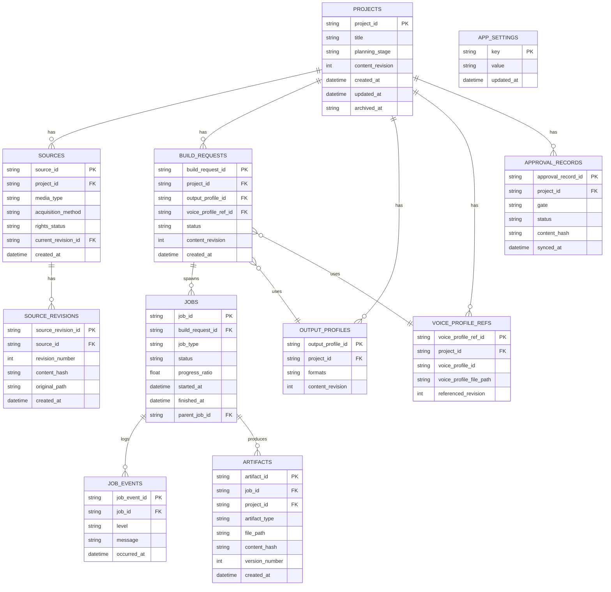

# DB論理スキーマ・制約・履歴

## 目的

`05-persistence-strategy.md`で選択した案2 (SQLiteをメタデータ正本、原素材・大型成果物はファイル)
を前提に、正規化しすぎず追跡性を保つ論理ERDと制約を作る。

## 背景

DBは新規導入であり、既存の実データ移行元は存在しない (`00`の監査参照)。
したがって本書は「移行スキーマ」ではなく「新規論理設計」である。

## 対象

- 論理エンティティの一覧と関連。
- PK/FK/unique/check/index の論理定義。
- 削除規則 (soft delete/archive)。
- versioning規則。
- path/hash列の扱い。
- 監査列。

## 対象外

- 物理DDL (CREATE TABLE文そのもの)。実装タスクで確定する。
- DBエンジン固有の型・インデックス実装詳細。

## 既存仕様との関係

`01-common-identifiers-and-versioning.md`のID規則 (`^[a-z0-9]+(?:-[a-z0-9]+)*$`)、
`content_revision`、`content_hash`の概念をDBカラムとしてそのまま踏襲する。

## 用語

`00-current-state-and-terminology.md`の用語集をそのまま使用する。

## 必要entity

| entity | 概要 |
|---|---|
| `projects` | Project(作品)メタデータ |
| `sources` | 素材メタデータ |
| `source_revisions` | 素材の版履歴 |
| `build_requests` | 制作依頼 |
| `jobs` | 処理ジョブ実行 |
| `job_events` | Jobの進捗・ログイベント |
| `artifacts` | 成果物索引 |
| `output_profiles` | 出力プロファイル |
| `voice_profile_refs` | 音声プロファイル参照 (本体はファイル) |
| `approval_records` | 承認サマリ (本体は`approvals.yaml`) |
| `app_settings` | アプリ全体設定 |

## Mermaid ERD

## entity一覧・PK/FK/unique/check/index

| entity | PK | FK | unique | check | index候補 |
|---|---|---|---|---|---|
| `projects` | `project_id` | - | - | `planning_stage`が既定列挙値のいずれか | `planning_stage`, `archived_at` |
| `sources` | `source_id` | `project_id` → projects | (`project_id`,`source_id`) | `media_type`が既定列挙値 | `project_id` |
| `source_revisions` | `source_revision_id` | `source_id` → sources | (`source_id`,`revision_number`) | `revision_number` >= 1 | `source_id` |
| `build_requests` | `build_request_id` | `project_id`→projects, `output_profile_id`→output_profiles, `voice_profile_ref_id`→voice_profile_refs | - | `status`が既定列挙値 | `project_id`, `status` |
| `jobs` | `job_id` | `build_request_id`→build_requests, `parent_job_id`→jobs (自己参照, retry履歴用) | - | `progress_ratio` 0.0〜1.0 | `build_request_id`, `status` |
| `job_events` | `job_event_id` | `job_id`→jobs | - | `level`が`info/warning/error`のいずれか | `job_id`, `occurred_at` |
| `artifacts` | `artifact_id` | `job_id`→jobs, `project_id`→projects | (`project_id`,`artifact_type`,`version_number`) | `version_number` >= 1 | `project_id`, `artifact_type` |
| `output_profiles` | `output_profile_id` | `project_id`→projects | - | `formats`が空でない | `project_id` |
| `voice_profile_refs` | `voice_profile_ref_id` | `project_id`→projects | - | - | `project_id` |
| `approval_records` | `approval_record_id` | `project_id`→projects | (`project_id`,`gate`) | `gate`が4値のいずれか、`status`が`07-approval-workflow.md`の状態列挙のいずれか | `project_id`, `gate` |
| `app_settings` | `key` | - | - | - | - |

`project_id`は`01-common-identifiers-and-versioning.md`のID正規表現に従う既存IDをそのまま
DBの論理主キーとして使用し、DB固有のsurrogate ID (auto increment数値ID) は導入しない
(表示名変更でIDが変わらない原則を維持するため)。

## 削除規則

- 物理削除 (`DELETE`)は、`app_settings`のような設定値以外では原則使用しない。
- `projects.archived_at`のような論理archiveカラムで削除相当を表現する (soft delete/archive方式)。
- `jobs`,`job_events`,`artifacts`は履歴として保持し続け、archiveされたProjectのJobも参照可能な
  状態を維持する (監査・トラブルシュートのため)。

## version規則

- `projects.content_revision`は`01-common-identifiers-and-versioning.md`の`content_revision`を
  そのままDBへ反映した値であり、DB側で独自採番しない (ファイル側の値に追従)。
- `artifacts.version_number`は同一`artifact_type`の再生成ごとに1ずつ増加させ、既存版を上書きしない
  (`10-output-and-export-settings.md`の「上書き禁止」方針と対応)。
- `source_revisions.revision_number`も1から始まり、素材の再取り込み・修正ごとに増加する。

## path/hash列

- `source_revisions.original_path`、`artifacts.file_path`は、`05`の正本マトリクスに従い
  「ファイルへのポインタ」として扱い、実体はDBに格納しない。
- `content_hash`はSHA-256文字列を格納し、`01-common-identifiers-and-versioning.md` §11の
  正規化ハッシュ手順と同じ計算方法を前提とする。

## 監査列

全entityは最低限 `created_at` を持ち、更新が発生するentity (`projects`,`build_requests`,`jobs`等)
は `updated_at` も持つ。`job_events`は追記専用のため`updated_at`を持たない。

## migration seed方針

- 初期migrationでは、上記entityのテーブルを作成するのみとし、サンプルデータのseedは行わない。
- 開発・テスト用のfixtureデータは、`14-testing-and-acceptance.md`側のテスト資材として別管理する
  (migration本体に埋め込まない)。

## 正常系

1. アプリ初回起動時、migrationが上記entityのテーブルを作成する。
2. Project作成時、`projects`へ1行挿入し、対応する`project-plan.yaml`をファイルへ書き込む。
3. Build Request作成時、`build_requests`へ1行挿入し、対応する`jobs`が後続で作成される。

## 異常系

| 状況 | 扱い |
|---|---|
| 存在しない`project_id`を参照する`sources`行を挿入しようとする | FK制約違反としてエラー |
| `artifacts.version_number`が既存より小さい値で挿入される | check制約違反、または上位のApplication Serviceでの事前検証エラー |
| `approval_records.gate`が4値以外 | check制約違反 |

## UIまたはAPIの入出力

本書はDBスキーマのみを扱うため、API入出力は`04-backend-api-and-service-boundary.md`を参照。

## 状態遷移

`jobs.status`、`build_requests.status`、`approval_records.status`の状態機械は
`07-project-task-job-workflow.md`で定義する。本書はそれらを保持するカラムの型・制約のみ扱う。

## データ所有者・正本

`05-persistence-strategy.md`の正本マトリクスに従う。

## バリデーション

### Error

- `project_id`をDB固有のsurrogate IDへ置き換える設計。
- `artifacts`のバージョンが上書きされる (既存versionを消す)設計。

### Warning

- 監査列 (`created_at`/`updated_at`) が一部entityで欠落している。

## セキュリティ・プライバシー

DBファイル自体のアクセス権・暗号化方針は`13-security-backup-migration.md`に委譲する。

## テスト観点

- 存在しない`project_id`を参照する行の挿入がFK制約で拒否される。
- 同一`artifact_type`の再生成で`version_number`が増加し、既存行が削除されない。
- `approval_records.gate`に不正な値を挿入するとエラーになる。
- DBを空の状態から再作成した場合、migrationが冪等に成功する。

## 移行・互換性

新規スキーマであり、移行対象データはない。将来ファイルからの初期同期処理 (`05`参照) を
実装する際、本書のentity定義をターゲットスキーマとする。

## 未決定事項

- 具体的なSQL型 (TEXT/INTEGER/DATETIME等のSQLite型マッピング) は実装タスクで確定する。
- `jobs.parent_job_id`による再試行履歴のたどり方の詳細UIは`12`で検討する。
- 将来的な複数利用者対応時の`projects`所有者カラム追加は本書スコープ外。

## 人間レビュー項目

- `human_review_required`: entity一覧・ERDの最終承認。
- `human_review_required`: soft delete/archive方針が実際の運用要求 (完全削除の必要性含む) と合致するか。
- 草案の採否と未決定事項。

## 仕様昇格条件

- ERDが`05`の正本マトリクスと矛盾しないこと。
- 削除規則・version規則が`07`,`10`の状態遷移・上書き禁止方針と整合すること。
- PoC (小規模な実データでのmigration実行) が`17-specification-promotion-plan.md`の計画に含まれていること。
