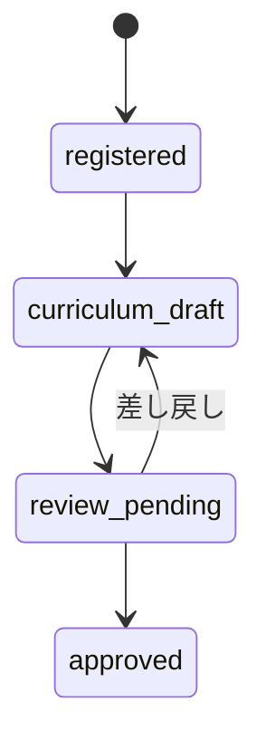
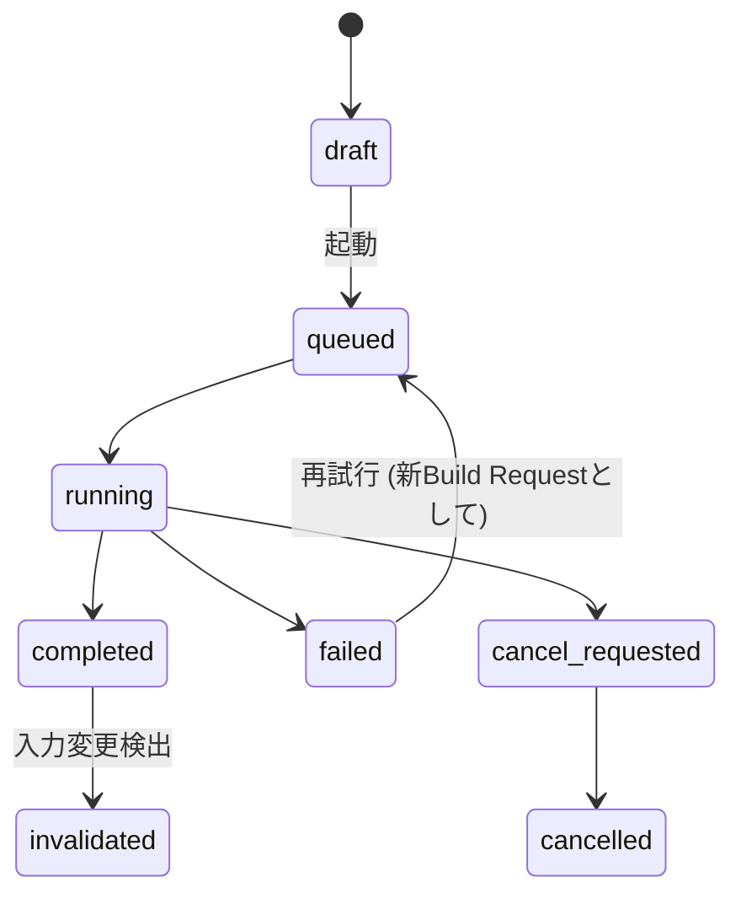
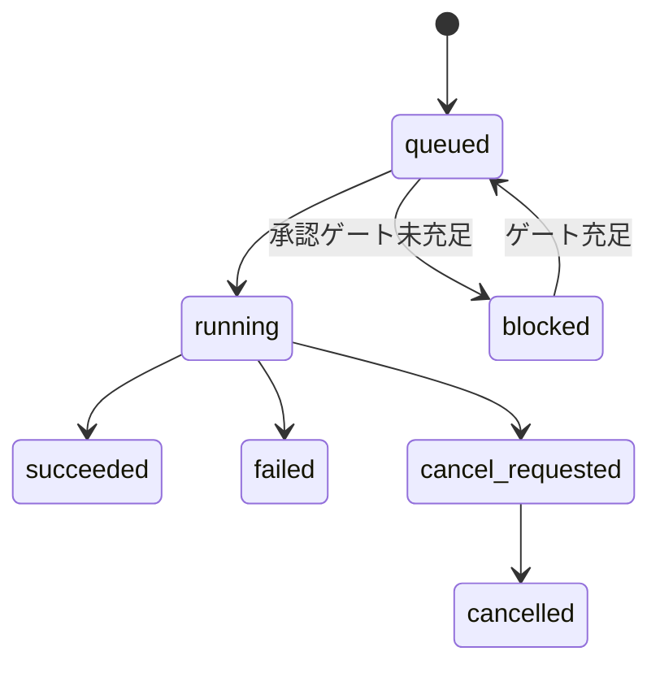
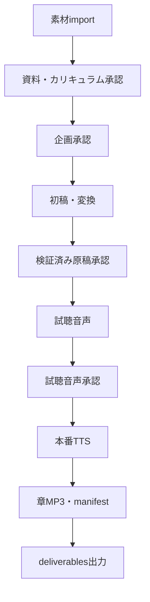

# Project・制作依頼・Jobの状態遷移

## 目的

利用者が作成する制作依頼と、内部処理Jobのstate machine、依存、再実行、承認gateを草案化する。

## 背景

`00`で`project`/`build_request`/`job`を分離する用語整理を行い、`06`でそれぞれのDBカラム
(`planning_stage`,`status`等)を定義した。本書はその状態機械の遷移規則を確定する。

## 対象

- Project (`planning_stage`)、Build Request、Jobそれぞれの状態機械。
- 再試行・再開。
- 依存DAG。
- 無効化規則。
- cancelの保証範囲。

## 対象外

- 個別Job種別 (import/draft/tts/export等) の入出力詳細 (→ `08`〜`13`各書)。

## 既存仕様との関係

| 既存仕様 | 関係 |
|---|---|
| `03-project-plan-schema.md` §3 | `planning_stage`の4状態 (`registered`/`curriculum_draft`/`review_pending`/`approved`) をそのままProjectの企画状態として使う。 |
| `07-approval-workflow.md` §3-4 | 承認状態 (`draft`〜`invalidated`) と遷移規則をそのままBuild Request起動の前提ゲートとして参照する。 |
| `audiobook-creation-pipeline.md` §9 | 正式な処理順序をJobの依存DAGの一次情報源とする。 |

## 用語

`00`の用語集を使用する。

## Project状態、Build Request状態、Job状態の分離

- **Project (`planning_stage`)**: 企画そのものの成熟度。長寿命 (`03-project-plan-schema.md`のまま)。
- **Build Request (`status`)**: 1回の出力意図。「この設定で今回はここまで作る」という単位。
- **Job (`status`)**: Build Requestから分解された実行単位 (import/draft/tts/export等)。

1つのBuild Requestに複数Jobが対応する。例: 1回の本番出力の中に
`draft_job`,`tts_job`,`export_job`が順に含まれる。

## Project状態機械

`03-project-plan-schema.md`のまま。



## Build Request状態機械



## Job状態機械

```yaml
job_status:
  - queued
  - running
  - succeeded
  - failed
  - cancel_requested
  - cancelled
  - blocked
```



## Transition表 (Job)

| 現在状態 | イベント | 遷移先 | 備考 |
|---|---|---|---|
| queued | 承認ゲート確認NG | blocked | `07-approval-workflow.md`のゲート判定 |
| queued | 実行開始 | running | サブプロセス起動 |
| running | 正常終了 | succeeded | artifactを生成 |
| running | 異常終了 | failed | エラー要約を記録 |
| running | cancel要求 | cancel_requested | 即座には停止しない |
| cancel_requested | プロセス終了確認 | cancelled | 完全停止後のみ |
| blocked | 承認完了 | queued | 再度キュー投入 |

## 1つの制作依頼に何Jobあるか

Build Requestの内容 (出力形式・声選択・対象章範囲) に応じて、次のJobへ分解する。

```text
import_job (素材未取込がある場合のみ)
↓
draft_job (原稿未生成の章がある場合)
↓
verification_job (主張検証・変換、既存パイプラインの該当工程)
↓
preview_job (試聴音声、承認前)
↓
tts_job (本番TTS、試聴承認後)
↓
package_job (章MP3・manifest生成)
↓
export_job (deliverablesへの出力)
```

Build Requestは、すでに完了済みの工程に対応するJobをスキップしてよい
(既存仕様の再利用条件 (`02-process-input-output.md` §14) に従う)。

## 失敗後の再開

失敗したJobは、その直前に成功したJobの成果物を再利用し、失敗したJob以降だけを
再実行する新しいBuild Requestを作成する (既存Build Requestを上書きしない)。
これはID/hashベースの再利用条件 (`audiobook-creation-pipeline.md` §16) をUI上で
体現するものである。

## 設定変更で何を無効化するか

`07-approval-workflow.md` §10の無効化表をそのまま適用する。画面上は、
無効化された承認に対応するJobを新規に起動しようとした際、「承認が無効化されています。
再承認が必要です」という警告とともに承認画面へ誘導する。

## 承認待ちJobの表現

承認ゲート未充足のJobは`blocked`状態とし、Job一覧に「承認待ち: <ゲート名>」を表示する。
自動的にポーリングして承認完了を検知し`queued`へ戻す。

## cancelとrollbackの意味

- **cancel**: 実行中のJobを安全に中断する。すでに書き込まれた中間ファイルは
  atomic writeの原則上、不完全な状態で正式パスへ反映されていないため、
  cancel後もファイルシステムは正常な状態を保つ。
- **rollback**: DBの状態を過去のBuild Requestに戻すことは行わない。
  「やり直し」は常に新しいBuild Request/Jobの作成として表現し、既存履歴を書き換えない。

## 依存DAG



## 無効化規則

`07-approval-workflow.md` §10をそのまま参照。本書はUI/Job層での反映方法のみ追加する。

## UIまたはAPIの入出力

Job起動・監視APIは`04-backend-api-and-service-boundary.md`を参照。

## 状態遷移

上記の3状態機械がそのまま本項の内容である。

## データ所有者・正本

`jobs.status`,`build_requests.status`はDB正本 (`06`参照)。`approvals.yaml`の承認状態はファイル正本。

## バリデーション

### Error

- 承認ゲート未充足のままJobが`running`へ遷移する。
- `cancelled`から直接`running`へ戻す遷移。

### Warning

- `blocked`状態が長時間放置されるまま自動退避されない (次期: 通知機能で緩和)。

## セキュリティ・プライバシー

強制実行 (`--force`)によるゲートバイパスは、既存仕様どおりCLI限定の開発者機能として維持し、
画面からは提供しない (`01`の方針と一致)。

## UI表示文言 (例)

| 状態 | 表示文言 |
|---|---|
| blocked | 「承認待ちのため停止中: 資料・カリキュラム承認」 |
| failed | 「失敗しました。詳細を確認して再試行してください」 |
| cancel_requested | 「中断処理中です…」 |

## 異常例

- 承認済みの原稿を修正した後、無効化された`verified_script`承認に気づかず本番TTSを起動しようとする
  → APIが403で拒否し、画面が再承認への導線を表示する。
- 電源断でJobが`running`のまま放置される → `12-job-monitoring-and-recovery.md`の
  stale job検出により`failed`へ遷移させる。

## テスト観点

- 承認ゲート未充足のJobが`blocked`のまま`running`へ進めない。
- 失敗Jobの再試行が新しいBuild Request/Jobとして記録され、失敗履歴が消えない。
- cancel要求後、プロセス終了確認まで`cancelled`にならない。
- 承認無効化発生時にJob起動APIが拒否する。

## 移行・互換性

既存の`07-approval-workflow.md`の状態値・遷移規則を変更しない。Build Request/Jobは
完全新規追加であり、既存スキーマとの互換性課題はない。

## 未決定事項

- Build Requestを「企画(`project-plan.yaml`)」の一部として吸収するか独立させ続けるかは
  実運用を経て見直す余地がある。
- stale job (異常終了検出)の具体的なタイムアウト値は`12`で確定する。

## 人間レビュー項目

- `human_review_required`: Build Request/Job分解の粒度 (図中の7段階Job)が過剰でないかの確認。
- `human_review_required`: rollback非提供方針(新規作成のみ)が運用上十分かの確認。
- 草案の採否と未決定事項。

## 仕様昇格条件

- 状態機械が`07-approval-workflow.md`,`03-project-plan-schema.md`と矛盾しないこと。
- 依存DAGが`audiobook-creation-pipeline.md` §9の工程順序と一致すること。
- 人間によるJob分解粒度の承認。
