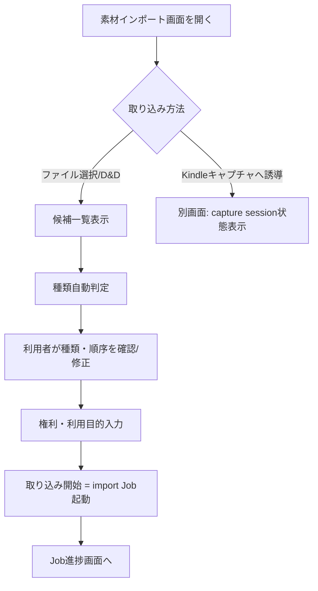

# 素材インポート画面と処理草案

## 目的

PDF、EPUB、画像、Kindle capture、既存text等の素材を画面から登録し、
権利・品質・順序を確認する導線を草案化する。

## 背景

`image-material-ingestion.md`、`kindle-capture.md`は資料入力の詳細仕様を既に承認済みだが、
これらは画面を前提としていない。本書はそれらの既存仕様をUIから操作可能にする層を追加する。

## 対象

- 対応素材とUIの対応。
- import画面導線。
- 順序編集。
- 重複・破損・容量超過時の扱い。
- copy/reference比較。
- rights review。

## 対象外

- OCR・抽出処理そのものの詳細 (既存仕様のまま)。
- Kindleキャプチャの画面操作アルゴリズム自体 (`kindle-capture.md`のまま)。

## 既存仕様との関係

| 既存仕様 | 関係 |
|---|---|
| `image-material-ingestion.md` | カメラ写真・スキャナ画像の登録UIは、同仕様のsession状態・manifest構造をそのまま画面に反映する。 |
| `kindle-capture.md` | Kindleキャプチャは画面操作 (マウス・キーボード) を伴うため、Docker非対応・ホスト直接実行が必須という`02`の判断根拠の一つになる。 |
| `04-backend-api-and-service-boundary.md` | multipart uploadをMVPの受け渡し方式として採用済み。 |

## 用語

`00`の用語集を使用する。「原本 (original)」「派生 (preprocessed/derivative)」の区別は
`image-material-ingestion.md`の定義に従う。

## 対応素材表

| media_type | 画面での扱い | MVP/次期 |
|---|---|---|
| text (既存テキスト) | ファイル選択またはテキスト直接貼り付け | MVP |
| pdf | ファイル選択 (PDF直接抽出は下位仕様`pdf-direct-text-extraction.md`未承認のためJob側は`evidence_gap`) | MVP (UIのみ、処理はJobが未確定の場合`blocked`表示) |
| epub | ファイル選択 (下位仕様未承認、`10`のEPUB出力同様disabled候補) | 次期 |
| image_sequence (カメラ写真・スキャナ) | 複数ファイル選択・ドラッグ順序編集 | MVP |
| kindle_capture | 別画面誘導 (画面内蔵の自動操作は行わず、`kindle-capture.md`のセッション状態を表示するのみ) | 次期 (キャプチャ自体はGUI操作を伴うため段階的導入) |

## 画面導線

## drag and drop、file picker、directory importの扱い

- MVPはブラウザ標準のfile input + drag&dropによる複数ファイル選択を採用する
  (`04`のmultipart upload方式と対応)。
- ディレクトリ丸ごとimportは、ブラウザのディレクトリ選択API対応状況に依存するため次期候補とする。

## 複数ファイルの順序確認

`image-material-ingestion.md` §9の優先順位 (manifest順→連番ファイル名→scanner順→撮影日時→
自然順ソート) をそのままUIのデフォルト順とし、利用者がドラッグで並べ替え可能にする。
撮影日時・自然順ソートのみに基づく順序確定時は、画面上で「人間プレビュー必須」の
注意書きを表示する (既存仕様の要求どおり)。

## 種類の自動判定と修正

拡張子・MIMEタイプから`media_type`/`acquisition_method`を推定し、一覧の各行に
ドロップダウンで修正可能な項目として表示する (既存仕様が「拡張子だけで判定してはならない」と
明記する形式については、実際のファイル内容検査を伴う判定ロジックを実装タスクで確定する)。

## 権利・利用目的の確認タイミング

取り込み開始前に、`image-material-ingestion.md` §15が要求する最低限の記録項目
(原資料の種類、利用者が利用できる根拠、利用目的、公開予定の有無、第三者個人情報の有無)を
フォームで必須入力とする。未入力のまま取り込み開始ボタンを押せないようにする。

## importをcopyするか参照するか

| 方式 | 説明 | 採用 |
|---|---|---|
| copy (immutableコピー) | アップロードされたファイルを`sources/originals/`へ複製保存 | MVP既定 |
| reference (元パス参照) | サーバー側の既存パスをそのまま参照し複製しない | 次期・advanced option候補 (大容量ファイルのコピー負荷回避のため) |

MVPでは既存仕様の「原本immutable」原則を単純に満たせるcopy方式を既定とし、
reference方式は`04`の「サーバー側ファイルシステムブラウザ」採用と合わせて次期検討する。

## 重複・破損・容量超過時の扱い

| 状況 | 扱い |
|---|---|
| 同一hashのファイルが既に登録済み | Warning表示、「重複の可能性があります。続行しますか」の確認 |
| ファイルを画像/PDF等として開けない | Error、取り込み対象から除外し理由を一覧に表示 |
| 単一ファイルまたは合計サイズが設定上限を超過 | Error、上限値は`app_settings`で設定可能にする (次期) |

## import Job分割

複数ファイルの取り込みは、`07-project-task-job-workflow.md`の`import_job`として
1つのJobにまとめるか、ファイル単位で分割するかを比較する。

| 方式 | 利点 | 欠点 |
|---|---|---|
| 1バッチ = 1 Job | 進捗管理がシンプル | 1ファイル失敗時に全体の扱いが複雑になる |
| ファイル単位で複数Job | 個別ファイルの成功/失敗が明確 | Job数が増え一覧が煩雑になる可能性 |

**採用判断**: MVPは「1バッチ=1 Job」とし、Job内の各ファイル結果をJobEvent単位で
記録する方式を採用する。ファイルごとの失敗が全体を止めないよう、失敗ファイルのみ
`review_required`として残し、成功ファイルは取り込み済み扱いにする部分的成功を許容する。

## UIまたはAPIの入出力

`POST /api/projects/{id}/sources` (multipart) を`04`のAPI一覧に対応させる。
レスポンスは取り込みJob IDを返す。

## 状態遷移

`image-material-ingestion.md` §8の取り込みセッション状態 (`not_started`〜`cancelled`)を
画面表示にそのまま反映する。

## データ所有者・正本

原本ファイルは`sources/originals/`配下 (ファイル正本、既存仕様どおり)。
取り込みセッションの一覧表示用メタデータはDB (`06`の`sources`,`source_revisions`)。

## バリデーション

### Error

- 権利・利用目的未記入のまま取り込みを開始できる設計。
- 原本ファイルを補正・変換結果で上書きする設計 (既存仕様違反)。

### Warning

- 自然順ソートのみに基づく順序確定を人間プレビューなしに確定させる設計。

## セキュリティ・プライバシー

- EXIF位置情報等の`preserved_private_metadata`/`exportable_metadata`区別は
  `image-material-ingestion.md` §12の既存方針をそのまま踏襲し、画面もexportable情報のみ表示する。
- 個人情報・肖像が写り込む可能性がある場合の`privacy_review_required`表示を画面に反映する。

## テスト観点

- 権利・利用目的未入力時に取り込み開始ボタンが無効化される。
- 重複候補が検出された場合に確認ダイアログが出る。
- 部分的成功 (一部ファイル失敗) がJob一覧・素材一覧の双方に正しく反映される。
- 自然順ソートのみの順序確定時に警告が表示される。

## 移行・互換性

既存の`image-material-ingestion.md`,`kindle-capture.md`のmanifest構造・処理順序を変更しない。
画面はこれらの操作レイヤーとして追加されるのみである。

## 未決定事項

- PDF直接抽出・EPUB抽出の下位仕様が未承認のため、これらのJob実行部分は`evidence_gap`として
  UIのみ先行させるか、Job未対応のまま「準備中」表示にするかは`17`のPoC計画で扱う。
- reference方式(非コピー取り込み)採用の要否。
- Kindleキャプチャの画面統合度合い (別ウィンドウ誘導か埋め込みか)。

## 人間レビュー項目

- `human_review_required`: PDF/EPUB下位仕様が未承認のまま、UIに選択肢として表示してよいか。
- `human_review_required`: import Job分割方針 (1バッチ=1 Job)の妥当性。
- 草案の採否と未決定事項。

## 仕様昇格条件

- 既存の`image-material-ingestion.md`,`kindle-capture.md`と矛盾しないことの確認。
- import Job設計が`07`のJob状態機械と整合すること。
- 権利・利用目的の必須入力がセキュリティ草案 (`13`)と整合すること。
