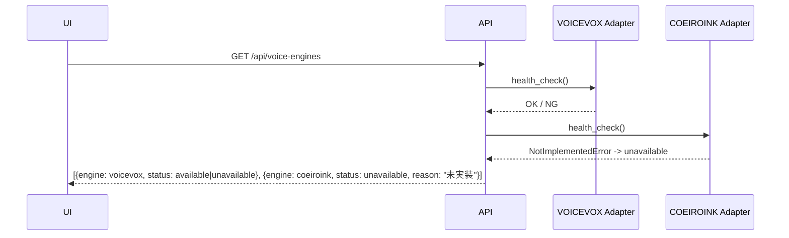

# 声・音声プロファイル・試聴選択

## 目的

VOICEVOX・COEIROINK等の声、style、速度、pitch等を画面で選択・試聴・保存する導線を草案化する。

## 背景

`script/tts_clients/voicevox/client.py`は実装済みでVOICEVOX HTTP API (`/speakers`,
`/audio_query`,`/synthesis`)を呼び出す。`script/tts_clients/coeiroink/client.py`は
`NotImplementedError`のみで未実装である (`00`の監査参照)。本書はこの実装差を前提とする。

## 対象

- engine/speaker/style列挙。
- engine未起動時の表示。
- 試聴原稿とcache。
- voice profile hierarchy。
- 利用条件表示。

## 対象外

- VOICEVOX/COEIROINKクライアントの内部実装変更 (実装コードは変更しない)。
- 出力設定そのもの (→ `10`)。

## 既存仕様との関係

`09-voice-profile-schema.md`のスキーマ (engine, speaker, parameters, pause, output,
engine_options)をそのままUIのフォーム構造として使う。status (`provisional`/`approved`等)の
意味も既存仕様のまま維持する。

## 用語

`00`,`09-voice-profile-schema.md`の用語を使用する。

## engine、speaker、styleをどう列挙するか

- VOICEVOX: 実装済みクライアントの`check_voicevox_running`相当のhealth checkと、
  (未実装だが仕様上存在する)`/speakers`エンドポイントから動的取得する。
- COEIROINK: クライアントが`NotImplementedError`であるため、画面上は
  「COEIROINKは現在利用できません (未実装)」と表示し、選択肢自体をdisabledにする。

## engine discovery



## engine未起動時の表示

VOICEVOXが起動していない場合 (`check_voicevox_running`相当が失敗)、
「VOICEVOX Engineに接続できません。起動してから再読み込みしてください」という
理由付きdisabled表示にする (`03`のdisabled状態方針と一致)。

## 試聴原稿とcache

`07-approval-workflow.md` §13の試聴対象 (導入・技術的定義・AI生成例え話・数字・英字・
専門用語・SQL/コード・注意事項・まとめ)を含む共通試聴原稿を既定候補として用意し、
中立原稿での試聴を許可する (既存仕様どおり)。

試聴結果はvoice_profile_id + パラメータ値のハッシュをキーにキャッシュし、
同一条件の再試聴はJobを再実行せずキャッシュから返す。

## profile hierarchy

`09-voice-profile-schema.md` §8の上書き優先順位 (CLI明示値 > segment上書き > 章上書き >
voice profile > book.json旧tts > ツール既定値)をそのままUIの「Project既定」「章上書き」
「segment上書き」の階層として表現する。

## Project既定と章・character上書き

画面はProject単位の既定voice profileを設定し、必要に応じて章単位で上書きできるようにする
(segment単位の上書きはMVP対象外、次期候補)。

## 推奨voiceと利用条件

`09-voice-profile-schema.md` §10の正式候補一覧 (VOICEVOX: 春日部つむぎ等、COEIROINK:
リリンちゃん等)をサジェストとして表示するが、「候補一覧は最終パラメータを意味しない」旨を
既存仕様どおり明記する。利用条件・クレジット表記は各エンジンの公式情報を画面下部に表示する
(実際のクレジット文言は人間が別途確認する、`evidence_gap`)。

## voice選択画面

```text
[エンジン選択: VOICEVOX (利用可) / COEIROINK (未実装)]
[話者一覧: サムネイル/名前]
[パラメータスライダー: 速度・音高・抑揚・音量]
[試聴ボタン → preview Job起動]
[プロファイルとして保存]
```

## preview Job

試聴は`07`のJob機構を使う軽量Job (`preview_job`)として扱う。長時間Jobではないため
進捗バーは簡略表示 (スピナー程度)で足りる。

## cache invalidation

`09-voice-profile-schema.md` §12のとおり、voice profile revisionまたはengine version変更時に
試聴承認を無効化する。UIキャッシュも同時に無効化し、再試聴を促す。

## 利用条件

エンジン・話者ごとのライセンス表記の最終文言は人間確認が必要 (`human_review_required`)。

## 異常系

| 状況 | 扱い |
|---|---|
| COEIROINKを選択しようとする | disabled、理由「未実装」 |
| VOICEVOX未起動 | disabled、理由「エンジン未接続」+ 再確認ボタン |
| provisionalなprofileを正式出力に使おうとする | `09-voice-profile-schema.md` §4の制約により拒否 (`10`の出力Jobと連携) |

## MVPと後続

| 機能 | 区分 |
|---|---|
| VOICEVOX話者選択・パラメータ調整・試聴 | MVP |
| Project既定voice profileの保存 | MVP |
| 章単位上書き | 次期 |
| segment単位上書き | 次期 |
| COEIROINK対応 | 次期 (クライアント実装が完了してから) |

## UIまたはAPIの入出力

`GET /api/voice-engines`,`GET /api/voice-profiles`,`POST /api/voice-profiles/{id}/preview`を
`04`のAPI一覧に追加する。

## 状態遷移

voice profileの`status`遷移は`09-voice-profile-schema.md` §4のまま変更しない。

## データ所有者・正本

voice profile本体は`project/voices/<id>.yaml`がファイル正本。DBは参照のみ保持する
(`05`の正本マトリクスどおり)。

## バリデーション

### Error

- COEIROINK未実装であるにもかかわらず選択・試聴できてしまう設計。
- provisional profileが正式出力に使用できてしまう設計。

### Warning

- engine未起動状態を検出せず試聴ボタンが有効なままになる。

## セキュリティ・プライバシー

音声エンジンへの通信は既定でloopback (localhost)を前提とし、外部エンジンへの
接続先変更はAPI keyやURLの取り扱いを含め`13`で扱う。

## テスト観点

- COEIROINK選択肢が常にdisabledで表示される (実装状況が変わるまで)。
- VOICEVOX未起動時にdisabled表示と再確認ボタンが機能する。
- 同一パラメータでの再試聴がキャッシュから即時返却される。
- voice profile revision変更で試聴承認が無効化される。

## 移行・互換性

`09-voice-profile-schema.md`のスキーマ・優先順位・現行`book.json`互換変換をそのまま維持する。

## 未決定事項

- COEIROINK実装完了時期 (実装タスク側の課題であり本書では確定しない)。
- 章・segment単位上書きのUI詳細。
- クレジット表記の最終文言。

## 人間レビュー項目

- `human_review_required`: 各エンジン・話者の利用条件表記の最終確認。
- `human_review_required`: COEIROINK対応時期の判断。
- 草案の採否と未決定事項。

## 仕様昇格条件

- `09-voice-profile-schema.md`と矛盾しないこと。
- COEIROINK未実装の扱いが実際のクライアント実装状況を正しく反映していること。
- 試聴Jobが`07`のJob機構と整合すること。
