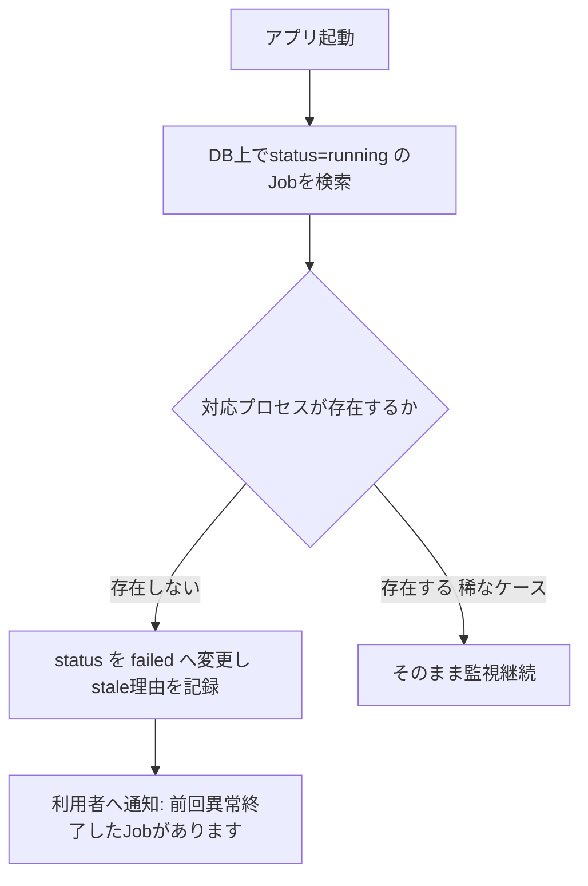

# 処理進捗・ログ・通知・中断復旧

## 目的

長時間処理を画面から監視し、cancel、retry、resume、失敗原因、再実行範囲を扱う仕様を草案化する。

## 背景

`07-project-task-job-workflow.md`でJob状態機械 (`queued`〜`cancelled`)を定義済み。
本書はその実行監視・障害復旧のUI/バックエンド設計を扱う。既存仕様に対応物がない
完全新規領域である (`00`の監査どおり)。

## 対象

- progress model。
- Job event (ログ)。
- cancel/retry/resume。
- stale running Job復旧。
- 同時実行制御。

## 対象外

- Job状態機械そのもの (`07`で確定済み)。

## 既存仕様との関係

`audiobook-creation-pipeline.md`の各工程 (OCR、初稿生成、TTS等)を、実行時にはJobとして
扱うため、各工程の入出力仕様はそのまま各Jobの処理内容の根拠とする。

## 用語

`00`の用語集を使用する。「stale job」= 実行中のはずが実際にはプロセスが存在しない
異常状態のJobを指す。

## 進捗率を何から計算するか

Job種別ごとに進捗基準を定義する。

| Job種別 | 進捗基準 |
|---|---|
| import_job | 処理済みファイル数 / 総ファイル数 |
| draft_job | 処理済み章数 / 対象章数 |
| tts_job | 処理済みsegment数 / 総segment数 (`14-audio-packaging.md`の結合順管理と対応) |
| export_job | 処理済み成果物数 / 総成果物数 |

## logをどこまで利用者へ見せるか

| ログ種別 | 利用者への表示 |
|---|---|
| 利用者向け要約 (例: 「章1の原稿を生成中」) | 常時表示 |
| 技術ログ (スタックトレース、API応答詳細) | 折りたたみ表示、既定は非表示 |

`04-backend-api-and-service-boundary.md`のerror schema (`user_message`/`detail`)分離を
Job Eventにもそのまま適用する。

## browserを閉じてもJobは継続するか

継続する。Jobはサーバー側サブプロセスとして実行され (`02`のジョブ処理方式)、
ブラウザとのSSE接続が切れてもJob自体は中断しない。再度画面を開いた際、
現在のJob状態をpollingで取得し表示を復元する。

## PC再起動後にresumeできるか

PC再起動・アプリ強制終了によりサブプロセスが失われた場合、Jobは完了していないにも
関わらずDB上`running`のまま残る「stale job」になりうる。起動時に次の手順で検出・復旧する。



resume (途中から再開)自体は行わず、既存仕様の再利用条件 (完了済み中間成果物の再利用)により
「最初からやり直しでも、既に完了した工程はキャッシュ的に再利用されるため実質的に高速に再開できる」
という設計方針を採る。

## 通知方式

| 方式 | MVP/次期 |
|---|---|
| アプリ内通知 (画面内バナー・バッジ) | MVP |
| OS通知 (Windows通知センター) | 次期 |

## 同時Job数はどう制限するか

MVPでは単一利用者・単一プロセス前提のため、Job実行を直列 (同時に1つのJobのみ実行中)に
制限することを既定とする。複数Jobがqueuedになった場合はFIFOで順次実行する。
将来、専用ワーカー方式 (`02`参照)へ移行する際に並列度を上げる余地を残す。

## progress model

```json
{
  "job_id": "job-0001",
  "job_type": "tts_job",
  "status": "running",
  "progress": {
    "processed": 4,
    "total": 12,
    "current_item": "ch01-seg005",
    "eta_seconds": null
  }
}
```

`eta_seconds`は不確実性が高いため、MVPでは`null`を許容し、無理に推測値を出さない
(`18-ai-model-routing-and-cost-control.md`の「推測値を実測値として保存しない」原則と同様の考え方)。

## Job event

```json
{
  "job_event_id": "evt-0001",
  "job_id": "job-0001",
  "level": "info",
  "message": "章1のTTS生成を開始しました",
  "occurred_at": "2026-07-19T21:00:00+09:00"
}
```

## ログlevelと保存期間

`info`/`warning`/`error`の3レベルとする。保存期間はMVPでは無期限 (archiveされたProjectの
Job履歴も保持)とし、容量診断機能 (次期)で古いログの整理を促す。

## cancel/retry/resume

- cancel: `07`の`cancel_requested`→`cancelled`遷移をそのまま使う。
- retry: 新しいJob (前述の`parent_job_id`で失敗Jobを参照)として作成する。
- resume: 個別工程からの再開は提供せず、「未完了の工程から自動的にやり直す」という
  Build Request単位の再実行として扱う (既存仕様の再利用条件により、完了済み部分は
  高速に処理されるため実質的なresumeとなる)。

## stale running Job復旧

上記フローのとおり。プロセス存在確認は、OSのプロセスID記録 (Job開始時にPIDを記録)を
起動時に確認する方式を採用する。

## 同時実行制御

直列実行 (MVP)。次期で専用ワーカー導入時に見直す。

## 画面例

```text
[Job一覧]
ID | 種類 | 状態 | 進捗 | 開始時刻 | 操作
job-0001 | tts_job | running | 4/12 | 21:00 | [キャンセル]
job-0000 | draft_job | failed | - | 20:45 | [再試行] [詳細]

[詳細画面]
要約: 「VOICEVOXへの接続に失敗しました」
[技術ログを表示 ▼]
```

## 異常系

| 状況 | 扱い |
|---|---|
| Job実行中にVOICEVOXが応答しない | `failed`、要約「音声エンジンに接続できません」、技術ログにHTTPエラー詳細 |
| PC再起動でstale job検出 | 起動時に`failed`へ変更し通知 |
| 同時に複数Jobを起動しようとする | 直列実行方針によりqueuedとして順番待ちにする (拒否はしない) |

## UIまたはAPIの入出力

`04`のJob関連API (`GET /jobs/{id}`,`GET /jobs/{id}/events`,`POST /jobs/{id}/cancel`)をそのまま使用する。

## 状態遷移

`07-project-task-job-workflow.md`のJob状態機械をそのまま参照する。

## データ所有者・正本

Job/JobEventはDB正本 (`06`参照)。

## バリデーション

### Error

- stale jobを起動時に検出せず`running`のまま放置する設計。
- retryが既存の失敗Job履歴を上書きして消す設計。

### Warning

- ETAを不確実なまま断定的な数値として表示する設計。

## セキュリティ・プライバシー

技術ログに機密情報 (APIキー等)が含まれないようにするマスキング方針は`13`で扱う。

## テスト観点

- PC強制終了を模したstale job (DBに`running`が残るがプロセスがない状態)が起動時に`failed`へ変わる。
- ブラウザを閉じて再度開いた場合、Job状態がpollingで正しく復元される。
- 直列実行方針により、複数Job起動要求がqueuedとして順番待ちになる。
- retry後も元の失敗Job履歴が保持される。

## 移行・互換性

新規領域のため移行対象なし。

## 未決定事項

- ETA推定アルゴリズムの要否 (次期)。
- OS通知の実装方式。
- 専用ワーカー方式への移行タイミング。

## 人間レビュー項目

- `human_review_required`: 直列実行制限がMVPとして十分か、それとも早期に並列実行が必要か。
- `human_review_required`: ログ無期限保存の運用可否 (容量診断機能の実装タイミング含む)。
- 草案の採否と未決定事項。

## 仕様昇格条件

- Job状態機械 (`07`)と矛盾しないこと。
- stale job検出方式がPoCで実証されていること (`17`のPoC計画対象)。
- ログレベル・保存方針がセキュリティ草案 (`13`)と整合すること。
