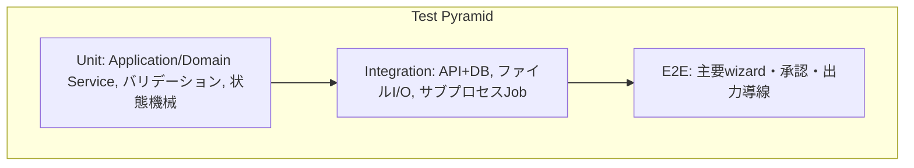

# テスト戦略・受け入れ条件・運用診断

## 目的

フロント、API、DB、Job、filesystem、TTS連携をテスト先行で実装できる受け入れ条件へ落とす。

## 背景

`16-ai-assisted-development-workflow.md`はテスト先行開発・`xfail(strict=True)`スキャフォールド・
Docker正式実行環境の原則を既に定めている。本書はこの原則を管理画面固有のテスト種別
(フロントE2E、DB migration、長時間Job)へ拡張する。

## 対象

- test pyramid。
- acceptance scenario。
- TC-ID候補。
- mock/fixture方針。
- migration/backup test。
- E2E対象。

## 対象外

- 実際のテストコード実装 (安全規則により`tests/`は変更しない)。

## 既存仕様との関係

`00-specification-guidelines.md` §8の共通テスト要件 (最小正常例、全項目正常例、必須項目欠落等)、
`16-ai-assisted-development-workflow.md`のTASK-ID/TC-ID体系をそのまま踏襲する。

## 用語

`00`の用語集を使用する。

## unit、integration、E2E、実機testの分け方



| 層 | 対象 | 外部依存 |
|---|---|---|
| Unit | 状態機械 (`07`)、バリデーション (`01-common-identifiers-and-versioning.md`準拠)、error schema変換 | なし (mock) |
| Integration | API+DB (一時SQLite)、ファイルI/O (一時ディレクトリ)、サブプロセスJob起動 | 一時リソースのみ、外部サービスなし |
| E2E | 新規作成→素材→承認→出力→成果物確認のハッピーパス | モックTTS/AIまたは実サービス (markerで分離) |
| 実機 (manual) | VOICEVOX実疎通、Kindleキャプチャ画面操作、Windows一コマンド起動 | 実サービス・実環境必須 |

## 外部TTSをmockするか

`16-ai-assisted-development-workflow.md` §14の既存方針 (unit/mock integration/external/manual分離)
をそのまま踏襲する。通常のCI相当実行では`pytest -m "not external and not manual"`を用い、
VOICEVOX実疎通は`external`マーカーで明示的に分離する。

## DB migrationをどうtestするか

- 空DBからのmigration適用が冪等に成功することをintegrationテストで確認する。
- 意図的に壊れたスキーマ状態からのmigration失敗時、アプリ起動が中断されることを確認する。
- migration前バックアップが作成されることを確認する (`13`参照)。

## 長時間Jobとcancelをどう再現するか

- テスト用に「意図的に遅延するダミーJob」を用意し、cancel要求後に安全に停止することを
  integrationテストで確認する。
- stale job検出は、DBへ直接`running`状態のレコードを挿入し、対応プロセスが存在しない状態を
  意図的に作ってテストする。

## Windowsの一コマンド起動をどう検証するか

自動テストでは検証しきれないため、`manual`マーカー相当の手動スモークテストとして
`walkwise-app.bat`実行→ブラウザが開く→Dashboardが表示される、という手順を
`docs/commands/`(将来の実装タスクで整備)に記載する運用とする。

## test pyramid

上記の図・表のとおり。

## acceptance scenario

| # | シナリオ | 対応MVP機能 |
|---|---|---|
| 1 | 新規Project作成→素材import→資料承認→企画承認→原稿生成→原稿承認→声選択→出力設定→本番Job→試聴承認→成果物確認 | `01`のハッピーパス全体 |
| 2 | 承認ゲート未充足でのJob起動が拒否される | `04`,`07`,`09` |
| 3 | Job実行中のcancelが安全に完了する | `12` |
| 4 | PC強制終了を模したstale jobが起動時にfailedへ変わる | `12` |
| 5 | DBを削除した状態からファイル群でメタデータが再構築される | `05` |
| 6 | EPUB出力がdisabledのまま提供されない | `10` |
| 7 | COEIROINKがdisabledのまま提供されない | `11` |

## 主要TC-ID候補

`16-ai-assisted-development-workflow.md`のTC-ID形式 (`TC-<領域>-<タスク連番>-<ケース連番>`)を
踏襲し、領域コード`APP`を用いる候補とする。

```text
TC-APP-001-01 新規Project作成の最小情報保存
TC-APP-001-02 registeredで章0件を許可
TC-APP-002-01 承認ゲート未充足時のJob起動403
TC-APP-002-02 承認hash不一致時のinvalidatedバッジ表示
TC-APP-003-01 Job cancel要求後の安全停止
TC-APP-003-02 stale job検出とfailedへの遷移
TC-APP-004-01 DB再構築 (ファイルからのメタデータ復元)
TC-APP-005-01 EPUB出力disabled表示
TC-APP-005-02 COEIROINK選択肢disabled表示
```

具体的な採番・詳細は実装タスク切り出し時にChatGPT側で確定する
(`16-ai-assisted-development-workflow.md`の役割分担どおり)。

## mock/fixture

- VOICEVOX: 既存`script/tts_clients/voicevox/client.py`のHTTP呼び出し部分をmockし、
  `check_voicevox_running`,`create_audio_query`,`synthesize_wave`相当の応答を固定する。
- Gemini: 既存`script/ai_clients/gemini/client.py`の`call_gemini`をmockする。
- DB: 一時SQLiteファイルまたはin-memory DBをテストごとに新規作成する。
- ファイルシステム: pytestの`tmp_path`相当の一時ディレクトリを使用する。

## migration/backup test

- 空DB→migration→スキーマ検証、の一連をintegrationテストにする。
- バックアップ→意図的破損→復元、の一連もintegrationテストとして用意する (`13`と対応)。

## E2E対象

`acceptance scenario`の#1 (ハッピーパス)を最優先のE2E対象とする。ブラウザ自動操作
フレームワーク (Playwright等)の採用可否は次期比較候補とし、本書では確定しない。

## 性能・容量

MVPでは明確な性能目標値を定めない (`evidence_gap`: 実利用データ規模が不明なため)。
次期で、Project数・章数・Job実行時間の代表値を計測してから目標値を設定する。

## diagnostics画面の受入条件

`03`の「設定・診断」画面について、次を受入条件とする。

- VOICEVOX疎通確認結果が表示される。
- Gemini APIキー設定有無 (値は非表示)が表示される。
- DB/ファイルの整合性チェック結果 (`05`のrepair方針と連携)が表示される。

## 正常系

テストスイート全体が`docker compose run --rm app pytest -m "not external and not manual"`
相当のコマンドで実行できる状態を目指す (既存の正式実行環境の原則を継承)。

## 異常系

外部サービス不通時にunit/integrationテストが失敗しない (mockで分離されているため)。

## UIまたはAPIの入出力

本書はテスト戦略のみを扱う。

## 状態遷移

対象外。

## データ所有者・正本

テストコード自体は`tests/`配下だが、本タスクでは実装しない (安全規則)。

## バリデーション

### Error

- 通常テストスイートが外部サービス (VOICEVOX実機等)へ依存し、CI環境で失敗する設計。

### Warning

- 性能目標値が未設定のまま次期へ持ち越される。

## セキュリティ・プライバシー

テストデータに実際の個人情報・購入コンテンツを含めない (既存`16-ai-assisted-development-workflow.md`の
一般原則を踏襲)。

## テスト観点

(本書自体がテスト観点の集合であるため、上記各節が該当する。)

## 移行・互換性

既存`16-ai-assisted-development-workflow.md`のタスク粒度・ID体系・完了報告書式をそのまま踏襲し、
新しいテスト体系を追加するものであり、既存規則を変更しない。

## 未決定事項

- E2Eブラウザ自動化フレームワークの採用可否。
- 性能・容量の具体的目標値。
- TC-ID採番の最終確定 (実装タスク切り出し時)。

## 人間レビュー項目

- `human_review_required`: E2Eフレームワーク採用の最終判断。
- `human_review_required`: 性能目標値設定のタイミング。
- 草案の採否と未決定事項。

## 仕様昇格条件

- test pyramidの層分けに人間の承認が得られていること。
- acceptance scenarioが`01`のMVPハッピーパスと一致すること。
- mock/fixture方針が`16-ai-assisted-development-workflow.md`の既存原則と矛盾しないこと。
