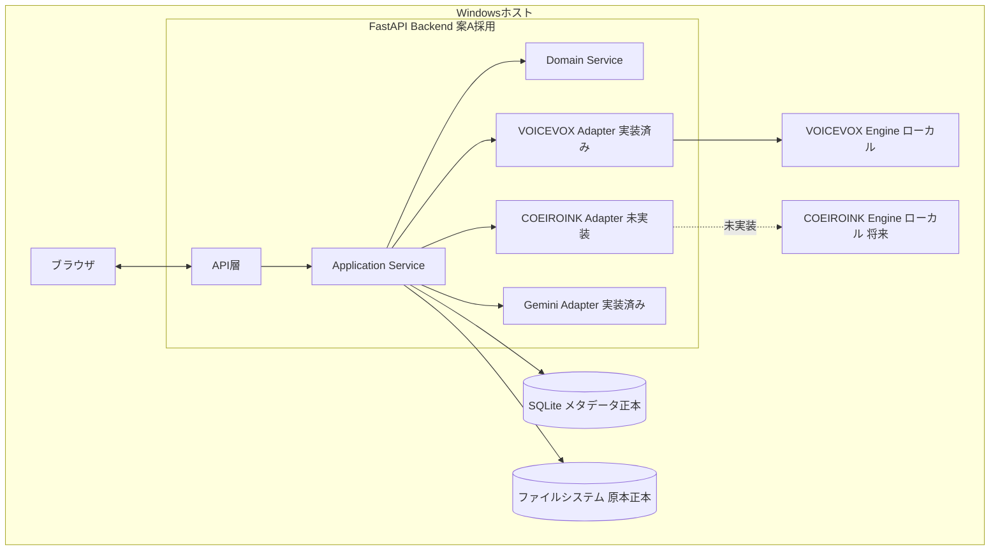
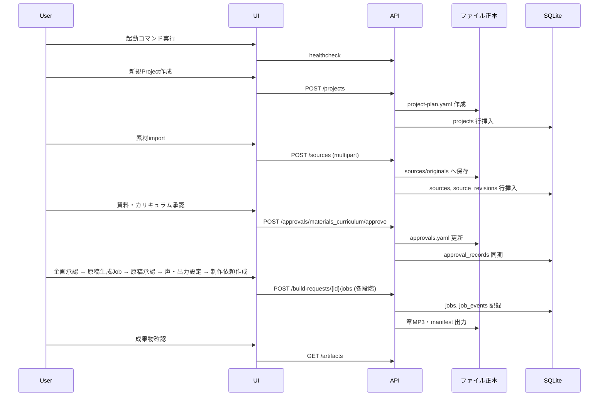

# フロント・DB管理の統合仕様草案

## 目的

個別草案 (00〜15)の矛盾を解消し、MVPとして一貫した管理アプリの統合草案を作る。

## 背景

本書は`docs/spec-proposals/generated-specifications/app-management/`配下の全個別草案を
統合する最終レイヤーである。個別草案間で確認した限り、明確な矛盾は検出されなかったが、
複数の`human_review_required`・`evidence_gap`が横断的に存在する (下記参照)。

## 対象

- 全体構成図。
- MVP screen/API/entity対応表。
- end-to-end sequence。
- 正本一覧。
- feature capability。
- 非機能要件。
- 未決定事項の集約。

## 対象外

- 各個別領域の詳細 (該当各書を参照)。

## 既存仕様との関係

各個別草案が既に既存仕様 (承認済み)との関係を明記済みであり、本書はそれらを集約する。
新たに既存仕様と矛盾する決定は行わない。

## 用語

`00-current-state-and-terminology.md`の用語集を全体の正とする。

## 全体構成図



## MVP screen/API/entity対応表

| 画面 (`03`) | 主なAPI (`04`) | 関連entity (`06`) |
|---|---|---|
| Dashboard | GET /projects | projects, approval_records, jobs |
| Project新規作成 | POST /projects | projects |
| Project詳細 | GET /projects/{id} | projects, sources, build_requests |
| 素材インポート | POST /projects/{id}/sources | sources, source_revisions |
| 承認一覧・詳細 | GET/POST /projects/{id}/approvals | approval_records |
| 出力設定 | GET/POST output-profiles | output_profiles |
| 声選択 | GET voice-engines, voice-profiles | voice_profile_refs |
| Job一覧・詳細 | GET/POST jobs | jobs, job_events |
| 成果物一覧 | GET /projects/{id}/artifacts | artifacts |
| 設定・診断 | GET /system/health (次期) | app_settings |

## end-to-end sequence (MVPハッピーパス)



## 正本一覧 (集約)

`05-persistence-strategy.md`の正本マトリクスをそのまま全体の正本一覧として採用する。
再掲はしない (単一の正本を維持するため、本書からは同書を参照するのみとする)。

## feature capability (機能フラグ想定)

| capability | 状態 | 理由 |
|---|---|---|
| output.epub | disabled | 下位仕様未確定 (`10`) |
| output.full_book_mp3 | disabled | `14-audio-packaging.md`がSHOULD止まり |
| voice.coeiroink | disabled | クライアント未実装 (`11`) |
| import.kindle_capture | 次期 | GUI操作統合が必要 (`08`) |
| import.reference_mode | disabled | copy方式のみMVP採用 (`08`) |

これらのdisabled理由は、実装が進み次第、機能フラグをtrueに切り替えるだけで有効化できる設計とし、
仕様自体の再設計を必要としないようにする。

## 非機能要件

| 項目 | 方針 |
|---|---|
| 可用性 | 単一利用者ローカルのため高可用性要件はなし。stale job復旧 (`12`)で最低限の耐障害性を確保 |
| セキュリティ | loopback限定、認証なし (`13`) |
| 性能 | 具体的数値目標は次期設定 (`14`) |
| 可搬性 | portable manifestによるexport/import (`05`, `15`の#19) |
| 保守性 | Application Service層でCLI/APIのロジックを共有 (`04`) |

## 未決定事項 (横断集約)

各個別草案の未決定事項のうち、複数書にまたがるものを集約する。

- 技術スタック最終決定 (案A/B/C、`02`) — 最優先の`human_review_required`。
- 永続化案最終決定 (案2、`05`) — PoC (`17`)後に確定。
- EPUB出力仕様の新規策定要否 (`10`)。
- COEIROINK実装完了時期 (`11`)。
- 認証機構導入の要否とタイミング (`13`)。

## 人間判断順序

1. 技術スタック (`02`)の採否。
2. 永続化方式 (`05`,`06`)の採否とPoC計画承認。
3. MVP機能範囲 (`01`,`15`のTop5)の最終確認。
4. セキュリティ方針 (`13`)の承認。
5. 個別画面・API詳細 (`03`,`04`,`08`〜`12`)のレビュー。

## 実装分割案

`16-ai-assisted-development-workflow.md`のタスク粒度原則 (1タスク1責務、変更ファイル1〜3、
テストケース3〜10)に従い、次の順で実装タスク (`TASK-APP-*`)へ分割することを推奨する
(実際のタスク作成は仕様承認後、`17-specification-promotion-plan.md`の手順に従う)。

```text
TASK-APP-001 DBスキーマとmigration基盤
TASK-APP-002 Project CRUD API
TASK-APP-003 Source import API (multipart, ファイル保存)
TASK-APP-004 承認API (既存approvals.yaml読み書き)
TASK-APP-005 Job基盤 (状態機械、サブプロセス起動)
TASK-APP-006 Job進捗API (SSE/polling)
TASK-APP-007 出力プロファイルAPI
TASK-APP-008 音声プロファイル参照・試聴API
TASK-APP-009 フロント: Dashboard/Project作成wizard
TASK-APP-010 フロント: 素材import画面
TASK-APP-011 フロント: 承認画面
TASK-APP-012 フロント: 出力・声選択画面
TASK-APP-013 フロント: Job監視・成果物画面
TASK-APP-014 起動launcher (一コマンド起動)
TASK-APP-015 バックアップ・診断機能
```

## 正常系

`end-to-end sequence`のとおり。

## 異常系

各個別草案の異常系表をそのまま集約参照する (重複記載を避ける)。

## UIまたはAPIの入出力

`03`,`04`を参照。

## 状態遷移

`07`を参照。

## データ所有者・正本

`05`を参照。

## バリデーション

### Error

- 個別草案間で正本の記述が矛盾する (今回の確認では検出されなかった)。

### Warning

- 未決定事項が`17`のPoC計画に反映されないまま昇格が進められる。

## セキュリティ・プライバシー

`13`を参照。

## テスト観点

`14`を参照。

## 移行・互換性

各個別草案の移行・互換性節をそのまま踏襲する。

## 未決定事項

上記「未決定事項 (横断集約)」のとおり。

## 人間レビュー項目

- `human_review_required`: 統合草案全体の整合性が実際に矛盾なく成立しているかの最終確認。
- `human_review_required`: 実装分割案 (TASK-APP-001〜015)の順序・粒度の妥当性。
- 草案の採否と未決定事項。

## 仕様昇格条件

- 全個別草案 (00〜15)が`review`または`provisional`状態で存在すること。
- 統合草案が矛盾を含まないことを人間が確認していること。
- 実装分割案が`16-ai-assisted-development-workflow.md`のタスク粒度原則に適合すること。
