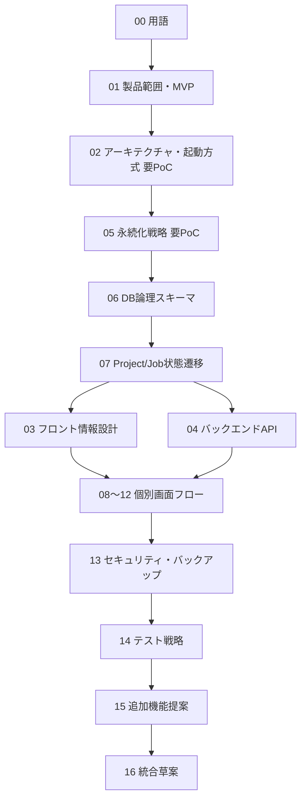

# 草案のレビュー・仕様昇格手順

## 目的

今回の草案をどのように検証・レビューし、承認済み仕様へ昇格し、
その後に実装タスクへ変換するかを具体化する。

## 背景

`16-integrated-application-proposal.md`で統合された草案群を、`docs/specifications/`へ
段階的に昇格する手順を定める。本タスク自体は`docs/specifications/`を変更しない
(安全規則)。

## 対象

- status transition。
- 昇格順序。
- 各仕様の承認条件。
- PoC計画。
- 人間review checklist。
- README/INDEX更新。
- 旧草案archive。
- 実装タスク生成規則。
- rollback。

## 対象外

- 実際の昇格作業の実行 (人間承認後の別作業)。

## 既存仕様との関係

`00-specification-guidelines.md` §9の完了条件 (最小例・完全例の存在、正本と派生物の区別等)を
昇格条件のベースラインとして使う。

## 用語

`00`の用語集を使用する。

## 一括昇格か分割昇格か

**分割昇格を推奨する。** 理由: 技術スタック・永続化方式のようにPoCが必要な領域と、
用語整理・MVP範囲のように比較的確定しやすい領域が混在しており、一括昇格は
PoC未検証部分を道連れに承認保留させてしまうリスクがある。

## 昇格順序

昇格順序候補 (タスク指示の初期推奨回答をそのまま採用):
用語 → 製品範囲 → architecture → persistence → DB → workflow → UI/API → 個別flow → security/test。

## 各仕様の承認条件

| 草案 | 承認条件 |
|---|---|
| `00-current-state-and-terminology.md` | 用語衝突が解消され、後続全草案で一貫使用されていることを人間が確認 |
| `01-product-scope-and-mvp.md` | MVP/次期/将来区分に人間の承認 |
| `02-architecture-and-runtime.md` | 技術スタック案の小規模PoC (下記) が完了していること |
| `05-persistence-strategy.md` | ファイル→DB再構築PoC (下記) が完了していること |
| `06-database-logical-schema.md` | ERDに矛盾がなく、`05`のPoC結果と整合すること |
| `07-project-task-job-workflow.md` | 状態機械が`07-approval-workflow.md`と矛盾しないことの確認 |
| `03`,`04` | API一覧・画面一覧が`01`のMVP範囲と一致すること |
| `08`〜`12` | 各既存下位仕様 (image-material-ingestion等)との矛盾がないこと |
| `13-security-backup-migration.md` | threat modelの人間レビュー完了 |
| `14-testing-and-acceptance.md` | test pyramidの人間承認 |
| `15-additional-feature-proposals.md` | Top5採用推奨の人間承認 |
| `16-integrated-application-proposal.md` | 全個別草案の承認完了後に最終昇格 |

## 技術選定にPoCが必要か

必要と判断する。次の2件を最小PoCとして推奨する。

### PoC-1: 一コマンド起動+FastAPI+SPA疎通確認

- 目的: `02`の案Aが実際にWindows上で一コマンド起動→ブラウザ表示まで到達するかを検証する。
- 範囲: 空のFastAPIエンドポイント1つ、最小限のSPAページ1枚。
- 完了条件: `walkwise-app.bat`相当のスクリプトからブラウザが自動で開き、ダミーAPI応答が表示される。

### PoC-2: SQLiteメタデータ正本+ファイル再構築

- 目的: `05`の「ファイルが正、DBは追従、DB消失時に再構築可能」という設計が成立するかを検証する。
- 範囲: サンプルのproject-plan.yaml 1件からSQLiteの`projects`行を再構築するスクリプト。
- 完了条件: DBファイルを削除した状態から、ファイルのみでメタデータテーブルを復元できる。

## DB schemaを承認する前に何を検証するか

- PoC-2の結果。
- `06`のERDが実際に外部キー制約でエラーなく作成できること (空のCREATE TABLE実行確認)。

## 昇格時にどのINDEX/READMEを更新するか

- `docs/specifications/README.md` (新規承認仕様の一覧追加)。
- `docs/tasks/APP_MANAGEMENT_SPEC_DRAFT_TASK_INDEX.md` (完了タスクのstatus更新)。
- `docs/tasks/APP_MANAGEMENT_SPEC_DRAFT_DECISIONS.md` (初期仮説を確定事項で置き換えるか、
  archiveするかの判断)。

これらの更新は人間承認後の別作業とし、本タスクでは実施しない。

## 草案をいつ削除・archiveするか

`docs/specifications/`への昇格が完了した草案は、`docs/spec-proposals/generated-specifications/
app-management/`内で削除せず、「`status: superseded`」等のマーカーを付けて残す
(既存の安全規則「既存ファイルを削除しない」を昇格後も維持する)。

## 人間review checklist

`APP_MANAGEMENT_REVIEW_CHECKLIST.md`として別途生成する (タスク39で作成)。

## 差分・リンク検査

昇格作業時、各草案が参照する`spec_refs`のリンク先が実在することを機械的に確認する
(本タスクでは`app-management-overnight-report.md`の構文検査結果として報告する)。

## README/INDEX更新

上記のとおり、人間承認後の実施事項として記録するに留める。

## 旧草案archive

削除せず`status`変更で管理する方針を上記のとおり採用する。

## 実装タスク生成規則

- `approved`後だけ`TASK-APP-*`実装タスクを作成する。
- `16-integrated-application-proposal.md`の実装分割案 (TASK-APP-001〜015)を初期候補とし、
  `16-ai-assisted-development-workflow.md`のタスク粒度原則に従って必要に応じて細分化する。

## rollback

- 仕様昇格後に重大な矛盾が発見された場合、当該`docs/specifications/`ファイルの`status`を
  `approved`から`review`等へ差し戻し、対応する実装タスクを`blocked`にする
  (`16-ai-assisted-development-workflow.md` §17のBLOCKED報告書式を使う)。
- ファイルの削除は行わず、版数 (version)を上げて改訂履歴を残す。

## 正常系

上記昇格順序・PoC・承認条件のとおり進めることを正常系とする。

## 異常系

| 状況 | 扱い |
|---|---|
| PoC-1が一コマンド起動に失敗する | `02`を`blocked`のまま維持し、案B等の代替を再検討する |
| PoC-2でDB再構築に失敗する | `05`を`blocked`のまま維持し、案1 (ファイル正本+索引)への変更を検討する |

## UIまたはAPIの入出力

対象外。

## 状態遷移

草案の`status`遷移は`review`/`provisional`/`blocked` → (人間承認) → `docs/specifications/`側の
`approved`という一方向のみを許可する。

## データ所有者・正本

本書が定義する昇格手順自体が正本である。

## バリデーション

### Error

- PoC未実施のまま`02`,`05`を承認しようとする。
- 昇格済み草案を削除する。

### Warning

- README/INDEX更新が昇格作業と同時に行われない。

## セキュリティ・プライバシー

対象外。

## テスト観点

- PoC-1, PoC-2それぞれの完了条件が明確でテスト可能であることを確認する。
- 昇格順序が個別仕様の依存関係 (`depends_on`)と矛盾しないことを確認する。

## 移行・互換性

既存の`16-ai-assisted-development-workflow.md`のタスク生成規則をそのまま踏襲する。

## 未決定事項

- PoCの実施時期・実施者。
- README/INDEX更新の自動化要否。

## 人間レビュー項目

- `human_review_required`: 昇格順序・PoC計画の最終承認。
- `human_review_required`: PoC実施の担当・スケジュール。
- 草案の採否と未決定事項。

## 仕様昇格条件

- 昇格順序・PoC計画に人間の承認が得られていること。
- PoC-1,PoC-2が完了し結果が記録されていること。
- rollback手順が実装タスク運用 (`16-ai-assisted-development-workflow.md`)と整合すること。
