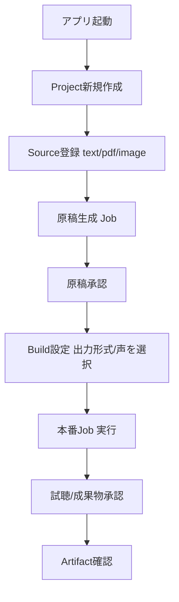

# アプリケーション製品範囲とMVP

## 1. 目的

オーディオブック作成システム自体を配布可能なローカルデスクトップアプリとして
提供するにあたり、単一利用者・単一PCを前提としたMVPの製品範囲を定義する。

## 2. 対象範囲

- 単一利用者のローカルデスクトップアプリという前提
- システム自体を配布対象とすること
- 初期対象プラットフォーム
- MVPの入力・出力・TTS engine
- MVP対象外
- Project/Source/BuildRequest/Job/Artifactの用語
- 最短のend-to-end導線
- Kindle専用ツールとの境界

## 3. 対象外

- Electron内部アーキテクチャの詳細(→`20-electron-desktop-architecture.md`)
- 画面ごとの詳細仕様(→`docs/screens/`)
- DBテーブル定義(→`docs/db/`)

## 4. 現行実装

現行コードには、資料入力・原稿生成・音声合成を横断するオーケストレーターや
フロントエンド、DBは存在しない。`script/`にはGemini APIクライアントと
VOICEVOXクライアントのみが実装済みである(COEIROINKクライアントは
`NotImplementedError`を送出する予約実装のみ)。本書はこの状態を前提とした
新規製品範囲の定義である。

## 5. 推奨仕様

### 5.1 前提

```yaml
application:
  type: desktop
  shell: electron
  renderer: vue
  initial_platform:
    - windows-x64
  distribution_target: system_itself
  single_user: true
```

- 本アプリは単一利用者・単一PCのローカルデスクトップアプリとして提供する。
- 生成物(オーディオブック本体)だけでなく、本システム自体の配布を視野に入れる。
- 初期対象プラットフォームはWindows x64とする。

### 5.2 用語

| 用語 | 定義 |
|---|---|
| Project | 一冊のオーディオブック制作単位。承認済み`project-plan.yaml`の`project_id`に対応する。 |
| Source | PDF、画像、テキスト等の素材。 |
| Build Request | 利用者が画面から作成する、1回の出力意図(出力形式・声・対象範囲を含む)。 |
| Job | Build Requestから分解された実行単位(素材処理・原稿生成・TTS・出力等)。 |
| Artifact | MP3、テキスト等の生成物。 |

これらの用語は`docs/db/`、`docs/screens/`を含む全ての承認済み仕様で共通に使用する。

### 5.3 MVPの入力・出力・TTS engine

```yaml
mvp:
  source_types:
    - text
    - pdf
    - image
  output_types:
    - mp3
    - text
  tts_engines:
    - voicevox
  job_concurrency: 1
```

PDF・画像はMVPの**素材登録対象**とする。ただし、PDF直接抽出・OCR処理そのものの
実行仕様は未確定であり、`docs/spec-proposals/`側の提案として扱う。MVPが承認するのは
「ファイルをSourceとして登録できる」契約(`docs/screens/02-project-workspace-and-source-import.md`、
`docs/db/02-sources-table.md`)であり、抽出処理自体の自動実行を保証しない。
抽出処理が未実装の間、登録されたSourceは「処理待ち」として表示し、
利用者が用意した既存テキストを直接入力する経路(`source_types: text`)で
end-to-end導線を完結できるようにする。

### 5.4 MVP対象外

```yaml
excluded_from_mvp:
  - kindle_capture
  - epub_output
  - m4b
  - video
  - recorded_audio
  - coeiroink
  - multi_user
  - cloud_sync
  - automatic_update
  - advanced_script_editor
  - parallel_jobs
  - postgresql
  - fastapi_server
```

Kindle画面キャプチャは本体の対象外とし、専用ツールへ分離する
(`docs/spec-proposals/kindle-capture-separate-tool.md`)。本体は、
外部ツールが生成した一般的な画像sequenceを取り込む契約だけを持つ
(`image-material-ingestion.md`参照)。

### 5.5 最短のend-to-end導線



この導線は`audiobook-creation-pipeline.md`が定義する4段階承認
(資料・カリキュラム/企画/検証済み原稿/試聴音声)を迂回しない。

### 5.6 Kindle専用ツールとの境界

本体は次を認識しない。

- Kindleアプリの操作、座標、ページ送り
- Kindle画面のキャプチャ処理そのもの

本体が受け付けるのは、専用ツールまたは外部プロセスが生成した画像sequenceと
manifestのみである(`image-material-ingestion.md`の一般的な画像入力契約に従う)。

## 6. 入力

- 利用者が用意するテキスト、PDF、画像ファイル

## 7. 出力

- MP3(章単位)
- テキスト(検証済み原稿)

## 8. 必須項目

- Project作成時の`title`、`domain`、`purpose`、`usage_purpose`、`target_audience`、`source_strategy`
  (`03-project-plan-schema.md`の`registered`段階の必須項目をそのまま使用)

## 9. 任意項目

- MVP対象外機能に対応する設定項目(将来拡張用に予約するが、MVPでは非表示)

## 10. バリデーション

### Error

- MVP対象外の機能(EPUB出力、COEIROINK、複数利用者等)をMVP画面へ表示する設計。
- Kindleアプリの操作・座標情報を本体が直接扱う設計。

### Warning

- なし(本書の範囲では警告に該当する状態はない)。

## 11. 状態・エラー・警告

Project/Job等の状態遷移は`22-job-lifecycle-and-recovery.md`で定義する。

## 12. 正常例

5.5節のend-to-end導線のとおり。

## 13. 異常例

| 状況 | 扱い |
|---|---|
| PDF/画像の抽出処理が未実装の状態でSourceを登録する | Sourceは「処理待ち」として登録され、テキスト直接入力の経路でend-to-end導線を継続できる |
| Kindle由来の画像sequenceを取り込む | 一般的な画像sequenceとして`image-material-ingestion.md`の契約どおり受け付ける。取り込み時にKindle固有の操作は発生しない |

## 14. テスト観点

- text入力だけでend-to-end導線が完結する。
- MVP対象外機能が画面に表示されない。
- 4段階承認が迂回できない。
- 外部ツールが生成した画像sequenceを一般契約として受け付けられる。

## 15. 移行・互換性

新規製品範囲の定義であり、移行対象となる既存実装はない。

## 16. 未決定事項

なし。

## 17. 完了条件

- 単一利用者ローカルデスクトップアプリという前提が明示されている。
- MVPの入力・出力・TTS engineが定義されている。
- MVP対象外が明示されている。
- Project/Source/BuildRequest/Job/Artifactの用語が定義されている。
- 最短end-to-end導線が定義されている。
- Kindle専用ツールとの境界が明示されている。
