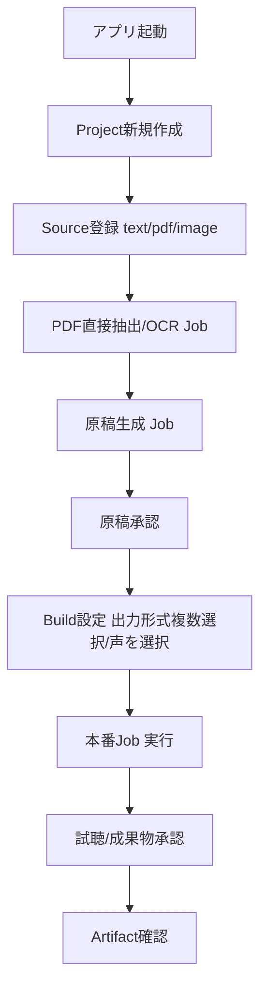

# アプリケーション製品範囲とMVP

## 1. 目的

オーディオブック作成システム自体を配布可能なローカルデスクトップアプリとして
提供するにあたり、単一利用者・単一PCを前提としたMVPの製品範囲と、
製品として恒久的に対象外とする範囲を定義する。

## 2. 対象範囲

- 単一利用者のローカルデスクトップアプリという前提
- システム自体を配布対象とすること
- 初期対象プラットフォーム
- MVPの入力・出力・素材処理・TTS engine
- post-MVP機能
- 製品の恒久的対象外
- Project/Source/BuildRequest/Job/Artifactの用語
- 最短のend-to-end導線

## 3. 対象外

- Electron内部アーキテクチャの詳細(→`20-electron-desktop-architecture.md`)
- 画面ごとの詳細仕様(→`docs/screens/`)
- DBテーブル定義(→`docs/db/`)
- PDF/OCR抽出アルゴリズムの詳細(→`pdf-direct-text-extraction.md`、`ocr-and-scanned-pdf.md`)

## 4. 現行実装

現行コードには、資料入力・原稿生成・音声合成を横断するオーケストレーターや
フロントエンド、DBは存在しない。`script/`にはGemini APIクライアントと
VOICEVOXクライアントのみが実装済みである(COEIROINKクライアントは
`NotImplementedError`を送出する予約実装のみ)。PDF直接抽出・OCR処理を含め、
本書がMVP必須と定める機能の実装コードも現時点では存在しない。
本書は、この状態を前提とした新規製品範囲の定義であり、
「仕様が承認されたこと」と「実装が完了したこと」を区別する。

## 5. 推奨仕様

### 5.1 前提

```yaml
application:
  type: desktop
  shell: electron
  renderer: vue
  initial_platform:
    - windows-x64
  distribution_target: system_itself
  single_user: true
```

- 本アプリは単一利用者・単一PCのローカルデスクトップアプリとして提供する。
- 生成物(オーディオブック本体)だけでなく、本システム自体の配布を視野に入れる。
- 初期対象プラットフォームはWindows x64とする。

### 5.2 用語

| 用語 | 定義 |
|---|---|
| Project | 一冊のオーディオブック制作単位。承認済み`project-plan.yaml`の`project_id`に対応する。 |
| Source | PDF、画像、テキスト等の素材。 |
| Build Request | 利用者が画面から作成する、1回の出力意図(出力形式・声・対象範囲を含む)。 |
| Job | Build Requestから分解された実行単位(素材処理・原稿生成・TTS・出力等)。 |
| Artifact | MP3、テキスト等の生成物。 |

これらの用語は`docs/db/`、`docs/screens/`を含む全ての承認済み仕様で共通に使用する。

### 5.3 MVPの入力・素材処理・出力・TTS engine

```yaml
mvp:
  source_types:
    - text
    - pdf
    - image
  source_processing:
    pdf_direct_extraction: required
    scanned_pdf_ocr: required
    image_ocr: required
  output_types:
    - mp3
    - text
  output_selection:
    multiple: true
    minimum: 1
  tts_engines:
    - voicevox
  job_concurrency: 1
```

- PDF・画像はMVPの素材登録対象であり、かつPDF直接抽出(`pdf-direct-text-extraction.md`)、
  スキャンPDF・画像OCR(`ocr-and-scanned-pdf.md`)はMVP必須の処理として承認済みである。
- textはPDF・OCRが失敗した場合でも利用できる手動入力経路として、引き続きMVP対象とする。
- Build Requestの出力形式は、MP3とテキストを同時に1件以上複数選択できる
  (`docs/db/03-build-requests-table.md`の`output_formats_json`)。
- 本書がMVP必須と定めることは、当該機能の**実装完了を意味しない**。
  「MVP completionに必要な未実装機能」として、実装タスク側で個別に管理する。

### 5.4 post-MVP機能

```yaml
post_mvp:
  - epub_input
  - m4b
  - coeiroink
  - asr_verification
```

- EPUB入力: `epub-text-extraction.md`(承認済み・post-MVP)。MVP画面には表示しない。
- M4B: `m4b-output.md`(承認済み・post-MVP)。章単位MP3を基本成果物とし、全文MP3は作成しない。
- COEIROINK: `docs/spec-proposals/coeiroink-client.md`(`status: blocked`)。公式API・実機情報が
  未確認のため、MVP後の追加TTS engine候補として保留する。
- ASR照合: `asr-script-audio-verification.md`(承認済み・post-MVPの任意review支援)。

### 5.5 製品の恒久的対象外

```yaml
permanently_out_of_scope:
  - kindle_capture
  - kindle_specific_tool
  - video_source_ingestion
  - recorded_audio_source_ingestion
  - drm_circumvention
```

次は、MVPだけでなく将来にわたって本製品が作成・提供しない機能である
(post-MVPの「将来検討」とは異なる、恒久的な対象外)。

- Kindleアプリの操作、座標、ページ送り、画面キャプチャ処理。Kindle専用ツールの開発も
  本プロジェクトでは行わない。
- 動画ファイル・動画URL・YouTube等の動画サービスを資料として取り込む機能。
- 授業録音・会議録音・音声メモ等を資料として取り込み、文字起こしする機能。
- DRMの解除・回避。

外部で任意の手段によって用意されたPNG/JPEG/TIFF等の画像ファイルは、
取得元をKindle固有方式として識別せず、一般的な画像素材
(`acquisition_method: existing_image_file`)として通常どおり取り込める。
これは上記の恒久的対象外と矛盾しない。「一般的な画像ファイルの取り込み」と
「Kindleアプリを操作してキャプチャする機能」は別である。

### 5.6 最短のend-to-end導線



この導線は`audiobook-creation-pipeline.md`が定義する4段階承認
(資料・カリキュラム/企画/検証済み原稿/試聴音声)を迂回しない。

## 6. 入力

- 利用者が用意するテキスト、PDF、画像ファイル

## 7. 出力

- MP3(章単位、1件以上の出力形式選択に含まれる場合)
- テキスト(検証済み原稿、1件以上の出力形式選択に含まれる場合)

## 8. 必須項目

- Project作成時の`title`、`domain`、`purpose`、`usage_purpose`、`target_audience`、`source_strategy`
  (`03-project-plan-schema.md`の`registered`段階の必須項目をそのまま使用)
- Build Request作成時の`output_formats_json`(1件以上)

## 9. 任意項目

- post-MVP機能に対応する設定項目(将来拡張用に予約するが、MVPでは非表示)

## 10. バリデーション

### Error

- post-MVPまたは恒久的対象外の機能(EPUB入力、COEIROINK、M4B、Kindle操作、動画・録音取込等)を
  MVP画面へ表示する設計。
- Kindleアプリの操作・座標情報を本体が直接扱う設計。
- PDF/OCRが「登録だけで処理は将来」であるかのように記述する設計(MVP必須処理であることと矛盾する)。

### Warning

- なし(本書の範囲では警告に該当する状態はない)。

## 11. 状態・エラー・警告

Project/Job等の状態遷移は`22-job-lifecycle-and-recovery.md`で定義する。
Sourceの処理状態は`docs/db/02-sources-table.md`で定義する。

## 12. 正常例

5.6節のend-to-end導線のとおり。

## 13. 異常例

| 状況 | 扱い |
|---|---|
| PDF/画像の抽出処理の実装が未完了の状態でSourceを登録する | 仕様上はMVP必須処理として扱われるが、実装未完了の間はJobが実行できない旨を実装状況として正確に記録する(仕様承認と実装完了を混同しない) |
| 外部ツールが生成した一般的な画像sequenceを取り込む | `image-material-ingestion.md`の一般契約どおり受け付ける。取り込み時にKindle固有の操作は発生しない |

## 14. テスト観点

- text入力だけでend-to-end導線が完結する。
- PDF/画像登録からOCR・抽出Jobが起動する経路が存在する。
- post-MVPおよび恒久的対象外の機能が画面に表示されない。
- 4段階承認が迂回できない。
- 出力形式の複数選択(MP3+テキスト)でBuild Requestを作成できる。

## 15. 移行・互換性

新規製品範囲の定義であり、移行対象となる既存実装はない。

## 16. 未決定事項

なし。

## 17. 完了条件

- 単一利用者ローカルデスクトップアプリという前提が明示されている。
- MVPの入力・素材処理・出力・TTS engineが定義されている。
- post-MVP機能と製品の恒久的対象外が区別して明示されている。
- Project/Source/BuildRequest/Job/Artifactの用語が定義されている。
- 最短end-to-end導線が定義されている。
- Kindle操作・Kindle専用ツール・動画・録音取込が恒久的対象外として明示されている。
- 仕様承認と実装完了が混同されていない。
