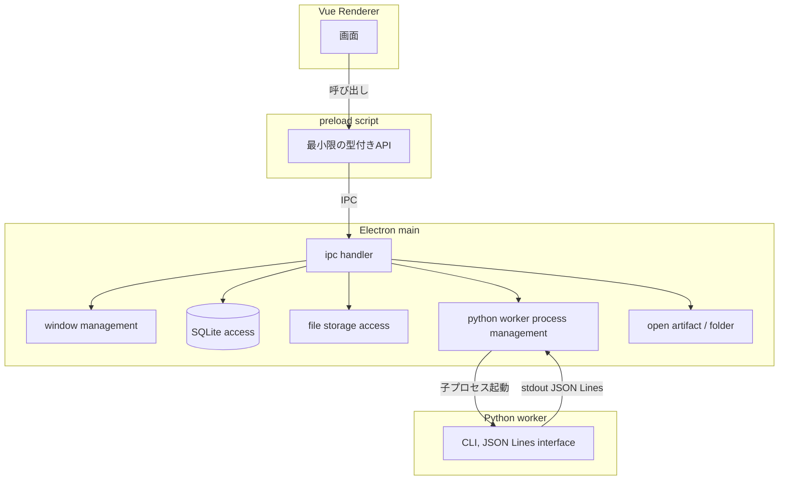

# Electronデスクトップアプリケーション構成

## 1. 目的

Electron main、preload、Vue renderer、IPC、SQLite、Python subprocess、
ファイルストレージを接続するアプリケーション構成を定義する。

## 2. 対象範囲

- Electron main / preload / renderer の責務分離
- IPCの契約
- SQLiteアクセスの所在
- Python subprocessとの境界
- process境界とセキュリティ設定
- FastAPI等のHTTPサーバーを採用しない理由と、将来採用する条件

## 3. 対象外

- Python worker側のCLI契約詳細(→`21-electron-python-worker-interface.md`)
- Job状態機械(→`22-job-lifecycle-and-recovery.md`)
- 配布・installer(→`23-distribution-and-platform-policy.md`)

## 4. 現行実装

現行コードにElectron・フロントエンド・DBの実装は存在しない。本書は新規構成の定義である。

## 5. 推奨仕様

### 5.1 プロセス構成



### 5.2 Electron mainの責務

```yaml
electron_main:
  responsibilities:
    - window_management
    - ipc
    - native_file_dialog
    - sqlite_access
    - python_worker_process_management
    - open_artifact_or_folder
```

SQLiteアクセス、ファイルシステムアクセス、Python workerプロセスの起動・監視・
終了は、すべてElectron mainプロセスに集約する。rendererはこれらへ直接アクセスしない。

### 5.3 preloadの責務

```yaml
preload:
  responsibilities:
    - expose_minimal_typed_api
  prohibited:
    - expose_node_api_directly
    - expose_arbitrary_ipc
    - expose_child_process_directly
    - expose_filesystem_directly
```

preloadは、rendererが呼び出せるAPIを最小限かつ型付きで公開する
(`contextBridge.exposeInMainWorld`相当)。Node.js API、任意のIPCチャネル、
`child_process`、ファイルシステムAPIをrendererへ直接公開しない。

### 5.4 セキュリティ設定

```yaml
browser_window_security:
  contextIsolation: true
  nodeIntegration: false
  sandbox: true
  allow_remote_module: false
```

- `contextIsolation: true`を必須とする。
- rendererへNode APIを直接公開しない。
- rendererからの任意コマンド実行を許可しない。preload越しに公開するAPIは、
  事前に定義された固定のIPCチャネル名と型付き引数だけを受け付ける。

### 5.5 Vue renderer

rendererはpreloadが公開するAPIのみを通じてmainと通信する。DOM操作・状態管理は
通常のVue 3アプリケーションとして実装し、Node.js固有APIには依存しない。

### 5.6 IPCの契約

IPCチャネルは、ユースケース単位の固定名とする。

```text
project:list
project:create
project:get
source:register
approval:list
approval:approve
approval:request-changes
build-request:create
job:start
job:get
job:subscribe-progress
job:cancel
artifact:list
artifact:open-folder
voice:list-engines
voice:preview
```

各チャネルは、リクエストとレスポンスの型をpreload側で固定し、
rendererが任意の文字列コマンドやシェルコマンドを組み立てて渡すことを許可しない。

### 5.7 SQLite

SQLiteへのアクセスはElectron mainプロセス内でのみ行う。rendererは
SQLiteへ直接接続しない。責務分担・正本境界は`17-local-data-persistence-policy.md`
に従う。

### 5.8 Python subprocessとの境界

Electron mainは、Python CLIを子プロセスとして起動・監視・終了する。
rendererからPython workerを直接起動することはない。契約の詳細は
`21-electron-python-worker-interface.md`で定義する。

### 5.9 file storage

原資料・生成原稿・音声等の大型コンテンツは、Electron mainがファイルシステムへ
読み書きする。rendererはファイルパスを直接扱わず、IPC経由でファイル操作を要求する。

### 5.10 FastAPIを採用しない理由

MVPでは、HTTPサーバー(FastAPI等)、REST API、SSE、WebSocket、ブラウザ自動起動を
採用しない。理由は次のとおりである。

- Electron IPCは、同一マシン内のmain-renderer間通信として、HTTPサーバーより
  シンプルな構成でユースケースを満たせる。
- ローカルHTTPサーバーを立てることは、ポート競合・外部からの接続可能性
  (loopback設定の管理)という追加のセキュリティ考慮を必要とし、単一利用者の
  デスクトップアプリでは不要な複雑性になる。
- ブラウザを自動起動して画面を開く方式は、Electronのネイティブウィンドウ表示
  よりも起動体験が劣る。

### 5.11 将来HTTP APIを追加する条件

次のいずれかが明確になった場合、HTTP API層の追加を再検討する。

- 複数利用者・リモートアクセスの要求が確定した場合。
- 本体プロセスとは独立した外部連携(ブラウザ拡張、モバイルアプリ等)の要求が確定した場合。

これらが確定しない限り、MVPおよびその後の当面の拡張においてもHTTPサーバーを
既定の通信経路にしない。

### 5.12 Electron採用のリスクと撤回条件

配布サイズ、メモリ使用量、Node.js依存はリスクとして記録するが、これらの理由
だけではElectron採用を撤回しない。撤回は、具体的で重大な阻害要因
(例: 対象プラットフォームで動作しない、致命的なセキュリティ欠陥が
Electron自体に存在する等)が確認された場合に限る。その場合は
`docs/spec-proposals/electron-adoption-blockers.md`へ根拠を記録して人間判断を仰ぐ。
本書の作成時点で、そのような阻害要因は確認されていない。

## 6. 入力

- rendererからのIPC呼び出し
- Python workerからのJSON Linesイベント(`21-electron-python-worker-interface.md`参照)

## 7. 出力

- rendererへ返すIPCレスポンス
- SQLite・ファイルシステムへの書き込み

## 8. 必須項目

- `contextIsolation: true`
- preloadを介した最小限API公開
- 固定IPCチャネル名

## 9. 任意項目

- 将来のHTTP API層(5.11節の条件を満たした場合のみ)

## 10. バリデーション

### Error

- rendererがNode.js APIまたは`child_process`へ直接アクセスできる設計。
- rendererが任意の文字列をシェルコマンドとして実行できる設計。
- `contextIsolation: false`での実装。

### Warning

- なし。

## 11. 状態・エラー・警告

IPC呼び出しのエラーは、利用者向け要約メッセージと技術detailを分離して
rendererへ返す(`21-electron-python-worker-interface.md`のエラー方針と対応)。

## 12. 正常例

利用者が画面から「Project作成」を実行すると、renderer→preload API→IPC→
Electron main→SQLite書き込みの順で処理され、結果がrendererへ返る。

## 13. 異常例

| 状況 | 扱い |
|---|---|
| rendererが未定義のIPCチャネルを呼び出そうとする | preloadで公開されていないため呼び出し自体が失敗する |
| Python workerプロセスが応答しない | Electron mainがtimeoutを検出し、Job状態を`failed`にする(`22`参照) |

## 14. テスト観点

- rendererからNode.js APIへ直接アクセスできないことを確認する。
- 固定IPCチャネル以外の呼び出しが失敗することを確認する。
- `contextIsolation`が有効な状態でpreload APIが機能することを確認する。

## 15. 移行・互換性

新規アーキテクチャであり、移行対象となる既存実装はない。

## 16. 未決定事項

なし。

## 17. 完了条件

- Electron main/preload/renderer境界が明記されている。
- rendererへNode APIを直接公開しない設計になっている。
- 任意コマンド実行を許可しない設計になっている。
- FastAPIをMVPでは採用しない理由と、将来採用する条件が明記されている。
