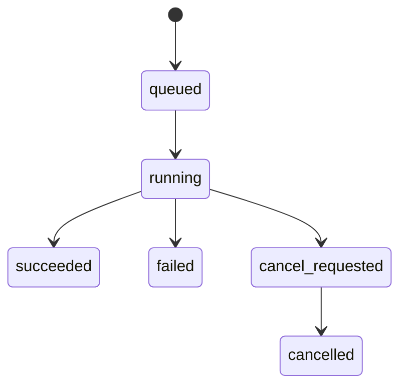
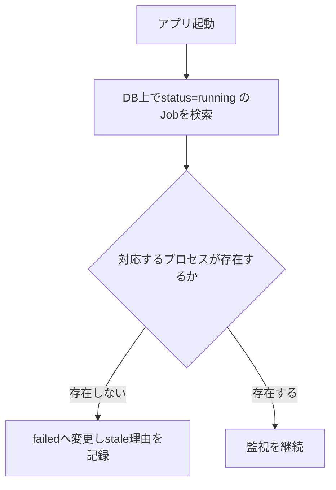

# Jobライフサイクルと復旧

## 1. 目的

Electron mainが管理するJob(Python worker実行単位)の状態機械、同時実行制御、
再試行、異常終了からの復旧を定義する。

## 2. 対象範囲

- Job状態の一覧と遷移
- 同時実行数とFIFO
- 再試行の記録方法
- stale job(異常終了で`running`のまま残ったJob)の検出
- 承認gateとJob実行の関係

## 3. 対象外

- Python worker内部のイベント形式(→`21-electron-python-worker-interface.md`)
- 画面表示の詳細(→`docs/screens/04-job-progress.md`)
- DBの列定義(→`docs/db/04-jobs-table.md`)

## 4. 現行実装

現行コードにJob管理の実装は存在しない。本書は新規導入方針である。

## 5. 推奨仕様

### 5.1 Job状態

```text
queued
running
succeeded
failed
cancel_requested
cancelled
```

MVPでは、承認待ちを表す独立した`blocked`状態をJobへ追加しない。理由は次のとおりである。

- `07-approval-workflow.md`が定義する4段階承認(資料・カリキュラム/企画/検証済み原稿/
  試聴音声)は、承認が必要な対象(資料一覧、企画、原稿、試聴音声)ごとの状態として
  既に`approvals.yaml`で管理されている。
- Job自体に`blocked`を追加すると、承認状態とJob状態の二重管理になり、
  「必要以上に状態を増やさない」という設計方針に反する。
- 承認ゲート未充足のJobは、そもそも`queued`へ投入させない(5.5節)。

### 5.2 状態遷移



### 5.3 同時実行数とFIFO

```yaml
job_execution:
  concurrency: 1
  queue_order: fifo
```

MVPでは同時実行数を1に制限する。複数のJobがqueuedになった場合、
投入順(FIFO)で順次実行する。並列実行は将来の拡張候補とする。

### 5.4 再試行

失敗したJobを上書きして再実行しない。再試行は新しいJobレコードとして記録し、
失敗したJobへの参照(`parent_job_id`相当、`docs/db/04-jobs-table.md`で定義)を保持する。
これにより、失敗履歴が失われず、再試行の追跡が可能になる。

### 5.5 承認gateとJob実行

Job起動前に、対象の承認状態(`07-approval-workflow.md`)を確認する。

```text
資料・カリキュラム未承認 -> 原稿生成Jobを起動しない
企画未承認 -> 原稿生成Jobを起動しない
検証済み原稿未承認 -> 本番TTS Jobを起動しない
試聴音声未承認 -> 正式出力Jobを起動しない
```

承認ゲート未充足の場合、Job自体を`queued`にせず、IPC呼び出しの時点でエラーを返す
(`code: approval_gate_not_satisfied`)。これにより、Job状態機械へ`blocked`を
追加せずに承認ゲートを表現する。

### 5.6 stale job検出

Electron main起動時、DB上で`running`のままのJobを検索し、対応するPythonプロセスが
実際に存在するかを確認する。対応するプロセスが存在しない場合、当該Jobを`failed`
へ遷移させ、理由(`stale_job_detected_on_startup`)を記録する。



再開(途中工程からの再開)は提供せず、失敗したJobは5.4節のとおり新しいJobとして
再実行する。既存の承認済みパイプライン仕様が定義する再利用条件
(`audiobook-creation-pipeline.md` 16節)により、既に完了済みの工程は
再利用され、実質的に高速な再実行になる。

### 5.7 Build実行の進捗段階(TASK-BUILD-EXEC-001)

BuildExecutionOrchestratorは、`jobs.last_message`へ次の段階名を記録することで
進捗を表現する(`docs/db/04-jobs-table.md`)。chapter単位の段階では
`<段階名>:<chapter_id>`の形式にし、`progress_current`/`progress_total`へ
処理済みchapter数/全chapter数を記録する。

```text
resolving_build_target
validating_verified_scripts
loading_voice_profile
checking_runtime
synthesizing_chapter
validating_audio
packaging_chapter
writing_text
writing_manifest
registering_artifacts
completed
```

text-onlyのBuildは`loading_voice_profile`/`checking_runtime`/
`synthesizing_chapter`/`validating_audio`/`packaging_chapter`を一切経由しない
(TTS/VOICEVOX/音声検証/ffmpegを呼び出さない)。

失敗時は`status: failed`とあわせて`jobs.error_code`/`error_stage`/
`error_detail_json`を記録する(`docs/db/04-jobs-table.md`)。`error_stage`は
上記の段階名と一致させる。安定したerror codeの例:
`build_target_not_ready`、`voice_profile_not_approved`、
`voice_profile_archived`、`tts_engine_unreachable`、`tts_synthesis_failed`、
`audio_validation_failed`。1chapterでも`build_target_not_ready`の原因が
あれば、TTS呼び出しを一切開始せずJob全体を拒否する
(`script/services/build_target_resolution.py`)。

## 6. 入力

- Build Requestからの Job起動要求
- Python workerからのJSON Linesイベント(`21`参照)

## 7. 出力

- Job状態、進捗、成果物参照(DBへ記録)

## 8. 必須項目

- `job_id`
- `job_type`
- `status`
- `build_request_id`

## 9. 任意項目

- `parent_job_id`(再試行時のみ)

## 10. バリデーション

### Error

- 承認ゲート未充足のままJobが`running`へ遷移する。
- `cancelled`から直接`running`へ戻る遷移。
- 失敗Jobの再試行が既存Jobレコードを上書きする。

### Warning

- なし。

## 11. 状態・エラー・警告

5.1節、5.2節のとおり。

## 12. 正常例

1. Build Request作成後、承認ゲートを確認する。
2. 充足していればJobを`queued`へ追加する。
3. 同時実行数1・FIFOに従い順次`running`にする。
4. Python workerからの`completed`イベントを受けて`succeeded`にする。

## 13. 異常例

| 状況 | 扱い |
|---|---|
| 承認ゲート未充足でJob起動を要求 | IPCエラー(`approval_gate_not_satisfied`)を返し、Jobを作成しない |
| Job実行中にcancel要求 | `cancel_requested`へ遷移し、プロセス終了確認後に`cancelled`へ |
| アプリ強制終了で`running`のまま残る | 次回起動時に`failed`(stale理由付き)へ遷移 |
| 失敗Jobを再試行 | 新しいJobレコードを作成し、失敗Jobへの参照を保持する |

## 14. テスト観点

- 承認ゲート未充足時にJobが作成されない。
- 同時実行数1・FIFOでJobが順次実行される。
- cancel要求後、プロセス終了確認まで`cancelled`にならない。
- stale job検出により`running`のまま残ったJobが`failed`になる。
- 再試行が新しいJobレコードとして記録され、失敗履歴が消えない。

## 15. 移行・互換性

新規機構であり、移行対象となる既存実装はない。

## 16. 未決定事項

なし。

## 17. 完了条件

- Job状態一覧(queued/running/succeeded/failed/cancel_requested/cancelled)が定義されている。
- 同時実行数1・FIFOが定義されている。
- 再試行が新しいJobとして記録される方針が定義されている。
- stale job検出方法が定義されている。
- 承認gateとJob実行の関係が、`blocked`状態を追加せずに定義されている。
